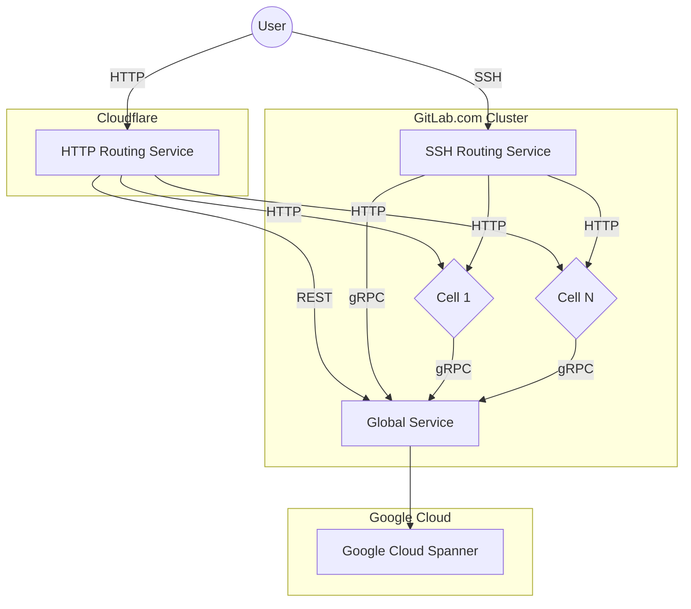

# Cells: Global Service

This document describes design goals and architecture of Global Service
used by Cells.

## Goals

The purpose of Global Service is to provide essential features for Cells
to operate. The Global Service will implement a limited set of functions
and serve a authoritative entity within the Cluster. There's only a single
Global Service, that can be deployed in many regions.

1. **Technology.**

    The Global Service will be written in [Golang](https://go.dev/)
    and expose API over [gRPC](https://grpc.io/).

1. **Cells aware.**

    The Global Service will contain a list of all Cells. The Global Service
    will monitor Cells health, and could pass this information down to Cells
    itself or Routing Service.

1. **Cloud first.**

    The Global Service will be deployed in Cloud, and use Cloud managed services
    to operate. Those services at later point could be extended with on-premise
    equivalents if required.

1. **Small.**

    The Global Service due to its criticality in architecture will be limited to
    provide only essential functions required for cluster to operate.

## Requirements

| Requirement         | Description                                                       | Priority |
| ------------------- | ----------------------------------------------------------------- | -------- |
| Discovery           | needs to be able to discover and monitor the health of all Cells. | high     |
| Security            | only authorized cells can use it                                  | high     |
| Cloud-managed       | can use cloud managed services to operate                         | high     |
| Self-managed        | can be eventually used by [self-managed](goals.md#self-managed)   | low      |
| Regional            | can route requests to different [regions](goals.md#regions)       | low      |

## Non-Goals

Those Goals are outside of the Global Service scope as they heavily inflate the complexity:

- The Global Service will not provide indexing of the user-facing information for Cells.
  Example: CI Catalog to show data available cluster-wide will have to use another means
  to merge the information from all Cells.

## Proposal

The Global Service implements the following design guidelines:

- Global Service implements only a few services.
- Global Service does not perform complex processing of information.
- Global Service does not aggregate information from Cells.



### Sequence Service

```proto
message CreateSequenceRequest {
  string table_name = 1;
  int64 block_size = 2;
}

service SequenceService {
  rpc CreateSequence(CreateSequenceRequest) returns (CreateSequenceResponse) {}
  rpc ValidateSequence(ValidateSequenceRequest) returns (ValidateSequenceResponse) {}
}
```

The purpose of this service is to global allocator of the [Database Sequences](impacted_features/database-sequences.md).

### Claim Service

```proto
enum ClaimType {
    Unknown = 0;
    Routes = 1;
};

message ClaimInfo {
    int64 id = 1;
    ClaimType claim_type = 2;
    string claim_value = 3;
    ...
}

service ClaimService {
    rpc CreateClaim(CreateClaimRequest) returns (CreateClaimResponse) {}
    rpc GetClaims(GetClaimsRequest) returns (GetClaimsResponse) {}
    rpc DestroyClaim(DestroyClaimRequest) returns (DestroyClaimResponse) {}
}
```

The purpose of this service is to provide a way to enforce uniqueness (ex. usernames, e-mails,
tokens) within the cluster.

### Classify Service

```proto
enum ClassifyMatch {
    Route = 0;
}

message ClassifyRequest {
    ClassifyMatch match = 2;
    string value = 3;
}

service ClassifyService {
    rpc Classify(ClassifyRequest) returns (ClassifyResponse) {
        option (google.api.http) = {
            get: "/v1/classify"
        };
    }
}
```

The purpose of this service is find owning cell of a given resource by string value.
Allowing other Cells, HTTP Routing Service and SSH Routing Service to find on which Cell
the project, group or organization is located.

## FAQ

1. Does Global Service implement all services for Cells 1.0?

    No, for Cells 1.0 Global Service will implement `ClaimService` and `ClassifyService` only.
    Due to complexity the `SequenceService` will be implemented by the existing Cell of the cluster.
    The reason is to reduce complexity of deployment: as we would only add a function to the first cell.
    We would add new feature, but we would not change "First Cell" behavior. At later point
    the Global Service will take over that function from First Cell.

1. How we will push all existing claims from "First Cell" into Global Service?

    We would add `rake gitlab:cells:claims:create` task. Then we would configure First Cell
    to use Global Service, and execute the rake task. That way First Cell would claim all new
    records via Global Service, and concurrently we would copy data over.

1. How and where the Global Service will be deployed?

    We will use [Runway](https://handbook.gitlab.com/handbook/engineering/infrastructure/platforms/tools/runway/),
    and configure Global Service to use [Spanner](https://cloud.google.com/spanner) for data storage.

1. How Global Service handle regions?

    We anticipate that [Spanner](https://cloud.google.com/spanner) will provide regional database support,
    with high-performance read access. In such case the Global Service will be run in each region
    connected to the same multi-write database. We anticipate one Global Service deployment per-region
    that might scale up to desired number of replicas / pods based on the load.

1. Will Global Service information be encrypted?

    This is yet to be defined. However, Global Service could encrypt customer sensitive information
    allowing for the information to be decrypted by the Cell that did create that entry.

## Links

- [Cells 1.0](cells-1.0.md)
- [Routing Service](routing-service.md)
- [Global Service PoC](https://gitlab.com/gitlab-org/tenant-scale-group/pocs/global-service)
