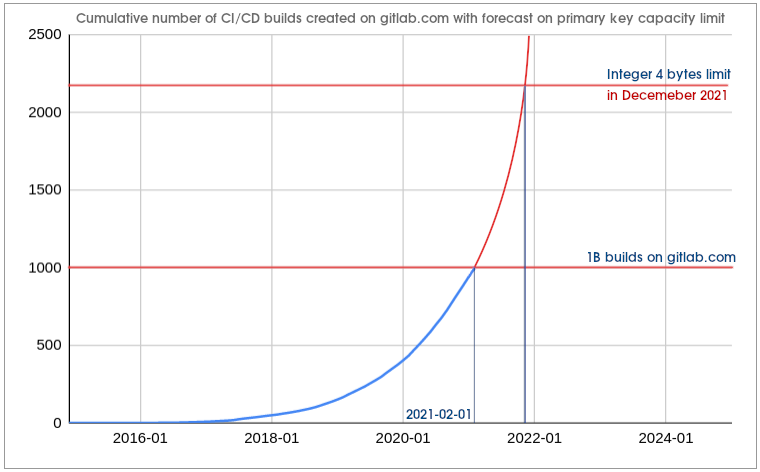

# Improve CI/CD builds data storage model

## Summary

GitLab CI/CD is one of the most data and compute intensive components features.
Since its [initial release in November 2012](https://about.gitlab.com/blog/2012/11/13/continuous-integration-server-from-gitlab/),
the CI/CD subsystem has evolved significantly. It was [integrated into GitLab in September 2015](https://about.gitlab.com/releases/2015/09/22/gitlab-8-0-released/)
and has become [one of the most beloved CI/CD solutions](https://about.gitlab.com/blog/2017/09/27/gitlab-leader-continuous-integration-forrester-wave/).

GitLab CI/CD has come a long way since the initial release, but the design of
the data storage for pipeline builds remains almost the same since 2012. We
store all the builds in PostgreSQL in `ci_builds` table, and because we are
creating more than [2 million builds each day on GitLab.com](https://docs.google.com/spreadsheets/d/17ZdTWQMnTHWbyERlvj1GA7qhw_uIfCoI5Zfrrsh95zU),
we are reaching database limits that are slowing our development velocity down.

On February 1st, 2021, a billionth CI/CD job was created and the number of
builds is growing exponentially. We will run out of the available primary keys
before December 2021 unless we improve the database model used to store CI/CD
builds.

## Goals

1. Transition primary key for `ci_builds` to 64-bit integer
1. Reduce the amount of data stored in `ci_builds` table
1. Devise a database partitioning strategy for `ci_builds` table

## Challenges

### We are running out of the capacity to store primary keys

The primary key in `ci_builds` table is an integer generated in a sequence.
Historically, Rails used to use [integer](https://www.postgresql.org/docs/9.1/datatype-numeric.html)
type when creating primary keys for a table. We did use the default when we
[created the `ci_builds` table in 2012](https://gitlab.com/gitlab-org/gitlab/-/blob/046b28312704f3131e72dcd2dbdacc5264d4aa62/db/ci/migrate/20121004165038_create_builds.rb).
[The behavior of Rails has changed](https://github.com/rails/rails/pull/26266)
since the release of Rails 5. The framework is now using bigint type that is 8
bytes long, however we have not migrated primary keys for `ci_builds` table to
bigint yet.

We will run out of the capacity of the integer type to store primary keys in
`ci_builds` table before December 2021. When it happens without a viable
workaround, GitLab.com will go down.

### The table is too large

There is more than a billion rows in `ci_builds` table. We store more than 2
terabytes of data in that table, and the total size of indexes is more than 1
terabyte.

This amount of data contributes to a significant problems related to having
this table in our database.

Most of the problem are related to how PostgreSQL database works internally,
and how it is making use of resources on a node the database runs on. We are at
the limits of vertical scaling of the primary database nodes and we frequently
see a negative impact of the `ci_builds` table on the overall performance,
stability, scalability and predictability of the database GitLab.com depends
on.

The size of the table also hinders development velocity because queries that
seem fine in the development environment may not work on GitLab.com. The
difference in the dataset size between the environments makes it difficult to
predict the performance of event the most simple queries.

### Background migrations are not reliable

We store a significant amount of data in `ci_builds` table. Some of the columns
in that table store a serialized user-provided data. Column `ci_builds.options`
stores more than 600 gigabytes of data (as of February 2021), and
`ci_builds.yaml_variables` more than 300 gigabytes.

We also need to migrate all the primary keys to `bigint`.

It is a lot of data that needs to be reliably moved to a different column or to
a different table. Perhaps to a different database. Unfortunately, right now,
background migration are not reliable enough to migrate data at scale. We need
to improve this mechanism to have confidence in that we are capable of moving
data as we see fit. Right now, evidence shows that it is not a case.

### Development velocity is negatively affected

Team members and the wider community members are struggling to contribute the
Verify area, because we restricted the possibility of extending `ci_builds`
even further. Our static analysis tools prevent adding more columns to this
table. Adding new queries is unpredictable because of the size of the dataset
and the amount of queries executed using the table. This significantly hinders
the development velocity and contributes to incidents on the production
environment.

## Iterations

1. Redesign background migrations to make them reliable
1. Migrate primary key of `ci_builds` table to 64-bit integer
1. Migrate eligible data out of the `ci_builds` table
1. Devise a partitioning strategy for `ci_builds` table

## Status

Blueprint in progress.

## Who

Proposal:

<!-- vale gitlab.Spelling = NO -->

| Role                         | Who
|------------------------------|-------------------------|
| Author                       | Grzegorz Bizon          |
| Architecture Evolution Coach | Kamil Trzciński         |
| Engineering Leader           | Darby Frey              |
| Product Manager              | TBD                     |
| Domain Expert / Verify       | Fabio Pitino            |
| Domain Expert / Database     | Jose Finotto            |
| Domain Expert / PostgreSQL   | Nikolay Samokhvalov     |

DRIs:

| Role                         | Who
|------------------------------|------------------------|
| Leadership                   | Darby Frey             |
| Product                      | TBD                    |
| Engineering                  | Grzegorz Bizon         |

<!-- vale gitlab.Spelling = YES -->
