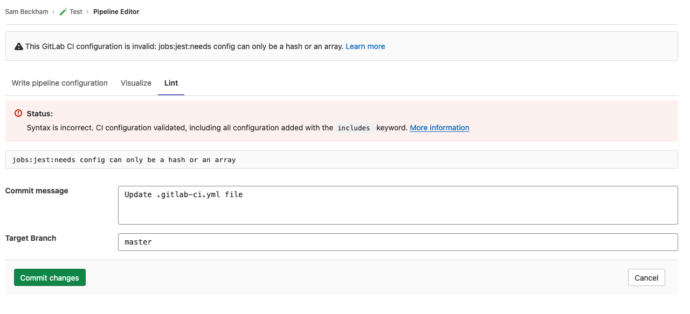
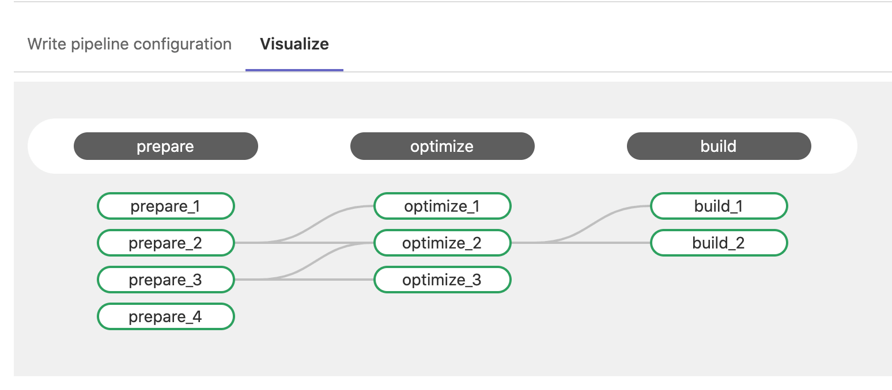

# Pipeline Editor **(FREE)**

> - [Introduced](https://gitlab.com/groups/gitlab-org/-/epics/4540) in GitLab 13.8.
> - [Feature flag removed](https://gitlab.com/gitlab-org/gitlab/-/issues/270059) in GitLab 13.10.

The pipeline editor is the primary place to edit the GitLab CI/CD configuration in
the `.gitlab-ci.yml` file in the root of your repository. To access the editor, go to **CI/CD > Editor**.

From the pipeline editor page you can:

- Select the branch to work from.
- [Validate](#validate-ci-configuration) your configuration syntax while editing the file.
- Do a deeper [lint](#lint-ci-configuration) of your configuration, that verifies it with any configuration
  added with the [`include`](../yaml/index.md#include) keyword.
- View a [list of the CI/CD configuration added with the `include` keyword](#view-included-cicd-configuration).
- See a [visualization](#visualize-ci-configuration) of the current configuration.
- View an [expanded](#view-expanded-configuration) version of your configuration.
- [Commit](#commit-changes-to-ci-configuration) the changes to a specific branch.

In GitLab 13.9 and earlier, you must already have [a `.gitlab-ci.yml` file](../quick_start/index.md#create-a-gitlab-ciyml-file)
on the default branch of your project to use the editor.

## Validate CI configuration

As you edit your pipeline configuration, it is continually validated against the GitLab CI/CD
pipeline schema. It checks the syntax of your CI YAML configuration, and also runs
some basic logical validations.

The result of this validation is shown at the top of the editor page. If your configuration
is invalid, a tip is shown to help you fix the problem:


## Lint CI configuration

NOTE:
The **Lint** tab is replaced with the **Validate** tab in GitLab 15.3. The lint results are included
in a successful [pipeline simulation](#simulate-a-cicd-pipeline).

To test the validity of your GitLab CI/CD configuration before committing the changes,
you can use the CI lint tool. To access it, go to **CI/CD > Editor** and select the **Lint** tab.

This tool checks for syntax and logical errors but goes into more detail than the
automatic [validation](#validate-ci-configuration) in the editor.

The results are updated in real-time. Any changes you make to the configuration are
reflected in the CI lint. It displays the same results as the existing [CI Lint tool](../lint.md).



## Simulate a CI/CD pipeline

> [Introduced](https://gitlab.com/gitlab-org/gitlab/-/issues/337282) in GitLab 15.3.

To look for pipeline syntax and logic issues, you can simulate the creation of a
GitLab CI/CD pipeline in the **Validate** tab. A pipeline simulation can help find
problems such as incorrect `rules` and `needs` job dependencies, and is similar to
simulations in the [CI Lint tool](../lint.md#simulate-a-pipeline).

## View included CI/CD configuration

> - [Introduced](https://gitlab.com/groups/gitlab-org/-/epics/7064) in GitLab 15.0 [with a flag](../../administration/feature_flags.md) named `pipeline_editor_file_tree`. Disabled by default.
> - [Feature flag removed](https://gitlab.com/gitlab-org/gitlab/-/issues/357219) in GitLab 15.1.

You can review configuration added with the [`include`](../yaml/index.md#include)
keyword in the pipeline editor. In the top right, select the file tree (**{file-tree}**)
to see a list of all included configuration files. Selected files open in a new tab
for review.

## Visualize CI configuration

> - [Introduced](https://gitlab.com/gitlab-org/gitlab/-/issues/241722) in GitLab 13.5.
> - [Moved to **CI/CD > Editor**](https://gitlab.com/gitlab-org/gitlab/-/issues/263141) in GitLab 13.7.
> - [Feature flag removed](https://gitlab.com/gitlab-org/gitlab/-/issues/290117) in GitLab 13.12.

To view a visualization of your `.gitlab-ci.yml` configuration, in your project,
go to **CI/CD > Editor**, and then select the **Visualize** tab. The
visualization shows all stages and jobs. Any [`needs`](../yaml/index.md#needs)
relationships are displayed as lines connecting jobs together, showing the
hierarchy of execution:



Hover over a job to highlight its `needs` relationships:


If the configuration does not have any `needs` relationships, then no lines are drawn because
each job depends only on the previous stage being completed successfully.

## View expanded configuration

> - [Introduced](https://gitlab.com/gitlab-org/gitlab/-/issues/246801) in GitLab 13.9.
> - [Feature flag removed](https://gitlab.com/gitlab-org/gitlab/-/issues/301103) in GitLab 13.12.

To view the fully expanded CI/CD configuration as one combined file, go to the
pipeline editor's **View merged YAML** tab. This tab displays an expanded configuration
where:

- Configuration imported with [`include`](../yaml/index.md#include) is copied into the view.
- Jobs that use [`extends`](../yaml/index.md#extends) display with the
  [extended configuration merged into the job](../yaml/yaml_optimization.md#merge-details).
- [YAML anchors](../yaml/yaml_optimization.md#anchors) are replaced with the linked configuration.
- [YAML `!reference` tags](../yaml/yaml_optimization.md#reference-tags) are also replaced
  with the linked configuration.

Using `!reference` tags can cause nested configuration that display with
multiple hyphens (`-`) in the expanded view. This behavior is expected, and the extra
hyphens do not affect the job's execution. For example, this configuration and
fully expanded version are both valid:

- `.gitlab-ci.yml` file:

  ```yaml
  .python-req:
    script:
      - pip install pyflakes

  lint-python:
    image: python:latest
    script:
      - !reference [.python-req, script]
      - pyflakes python/
  ```

- Expanded configuration in **View merged YAML** tab:

  ```yaml
  ".python-req":
    script:
    - pip install pyflakes
  lint-python:
    script:
    - - pip install pyflakes  # <- The extra hyphens do not affect the job's execution.
    - pyflakes python/
    image: python:latest
  ```

## Commit changes to CI configuration

The commit form appears at the bottom of each tab in the editor so you can commit
your changes at any time.

When you are satisfied with your changes, add a descriptive commit message and enter
a branch. The branch field defaults to your project's default branch.

If you enter a new branch name, the **Start a new merge request with these changes**
checkbox appears. Select it to start a new merge request after you commit the changes.


## Troubleshooting

### `Configuration validation currently not available` message

This message is due to a problem with the syntax validation in the pipeline editor.
If GitLab is unable to communicate with the service that validates the syntax, the
information in these sections may not display properly:

- The syntax status on the **Edit** tab (valid or invalid).
- The **Visualize** tab.
- The **Lint** tab.
- The **View merged YAML** tab.

You can still work on your CI/CD configuration and commit the changes you made without
any issues. As soon as the service becomes available again, the syntax validation
should display immediately.
