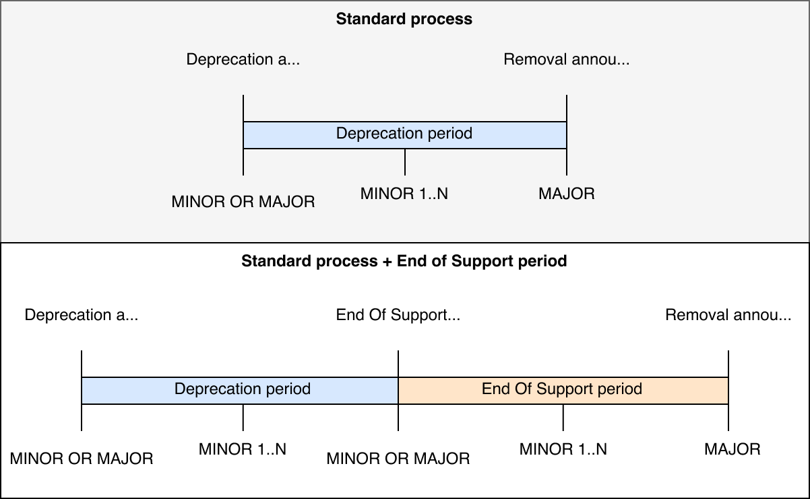

# Deprecating GitLab features

This page includes information about how and when to remove or make breaking changes
to GitLab features.

## Terminology

<!--
If updating these definitions, be sure to update them in the handbook as well:
https://about.gitlab.com/handbook/product/gitlab-the-product/#definitions
-->

**Deprecation**:

- Required before ending support for a feature or removing a feature.
- Feature not recommended for use.
- Development restricted to Priority 1 / Severity 1 bug fixes.
- Will be removed in a future major release.
- Begins after a deprecation announcement outlining an end-of-support or removal date.
- Ends after the end-of-support date or removal date has passed.

**End of Support**:

- Optional step before removal.
- Feature usage strongly discouraged.
- No support or fixes provided.
- No longer tested internally.
- Will be removed in a future major release.
- Begins after an end-of-support date has passed.

[Announcing an End of Support period](https://about.gitlab.com/handbook/marketing/blog/release-posts/#announcing-an-end-of-support-period)
should only be used in special circumstances and is not recommended for general use.
Most features should be deprecated and then removed.

**Removal**:

- Feature usage impossible.
- Feature no longer supported (if End of Support period hasn't already been announced).
- Happens in a major release in line with our
  [semantic versioning policy](../../policy/maintenance.md).
- Begins after removal date has passed.

**Breaking change**:

A "breaking change" is any change that requires users to make a corresponding change to their code, settings, or workflow. "Users" might be humans, API clients, or even code classes that "use" another class. Examples of breaking changes include:

- Removing a user-facing feature without a replacement/workaround.
- Changing the definition of an existing API (by doing things like re-naming query parameters or changing routes).
- Removing a public method from a code class.

A breaking change can be considered major if it affects many users, or represents a significant change in behavior.



## When can a feature be deprecated?

Deprecations should be announced on the [Deprecated feature removal schedule](../../update/deprecations.md).

Do not include the deprecation announcement in the merge request that introduces a code change for the deprecation.
Use a separate MR to create a deprecation entry. For steps to create a deprecation entry, see
[Deprecations](https://about.gitlab.com/handbook/marketing/blog/release-posts/#deprecations).

## How are Community Contributions to a deprecated feature handled?

Development on deprecated features is restricted to Priority 1 / Severity 1 bug fixes. Any community contributions to deprecated features are unlikely to be prioritized during milestone planning.

However, at GitLab, we [give agency](https://about.gitlab.com/handbook/values/#give-agency) to our team members. So, a member of the team associated with the contribution may decide to review and merge it at their discretion.

## When can a feature be removed/changed?

Generally, feature or configuration can be removed/changed only on major release.
It also should be [deprecated in advance](https://about.gitlab.com/handbook/marketing/blog/release-posts/#deprecations).

For API removals, see the [GraphQL](../../api/graphql/index.md#deprecation-and-removal-process) and [GitLab API](../../api/index.md#compatibility-guidelines) guidelines.

For configuration removals, see the [Omnibus deprecation policy](../../administration/package_information/deprecation_policy.md).

For versioning and upgrade details, see our [Release and Maintenance policy](../../policy/maintenance.md).

## Update the deprecations and removals documentation pages

The [deprecations](../../update/deprecations.md) and [removals](../../update/removals.md)
documentation is generated from the YAML files located in
[`gitlab/data/`](https://gitlab.com/gitlab-org/gitlab/-/tree/master/data).

To update the deprecations and removals pages when an entry is added,
edited, or removed:

1. From the command line, navigate to your local clone of the [`gitlab-org/gitlab`](https://gitlab.com/gitlab-org/gitlab) project.
1. Create, edit, or remove the YAML file under [deprecations](https://gitlab.com/gitlab-org/gitlab/-/tree/master/data/deprecations)
   or [removals](https://gitlab.com/gitlab-org/gitlab/-/tree/master/data/removals).
1. Compile the deprecation or removals documentation with the appropriate command:

   - For deprecations:

     ```shell
     bin/rake gitlab:docs:compile_deprecations
     ```

   - For removals:

     ```shell
     bin/rake gitlab:docs:compile_removals
     ```

1. If needed, you can verify the docs are up to date with:

   - For deprecations:

     ```shell
     bin/rake gitlab:docs:check_deprecations
     ```

   - For removals:

     ```shell
     bin/rake gitlab:docs:check_removals
     ```

1. Commit the updated documentation and push the changes.
1. Create a merge request using the [Deprecations](https://gitlab.com/gitlab-org/gitlab/-/blob/master/.gitlab/merge_request_templates/Deprecations.md)
   or [Removals](https://gitlab.com/gitlab-org/gitlab/-/blob/master/.gitlab/merge_request_templates/Removals.md) templates.

Related Handbook pages:

- <https://about.gitlab.com/handbook/marketing/blog/release-posts/#deprecations-removals-and-breaking-changes>
- <https://about.gitlab.com/handbook/marketing/blog/release-posts/#update-the-deprecations-and-removals-docs>

## Update the related documentation

When features are deprecated and removed, [update the related documentation](../documentation/versions.md#deprecations-and-removals).
