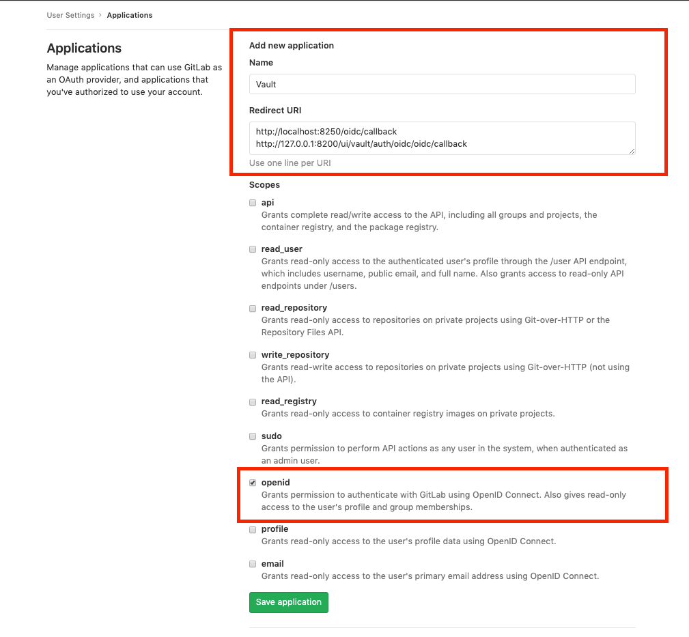
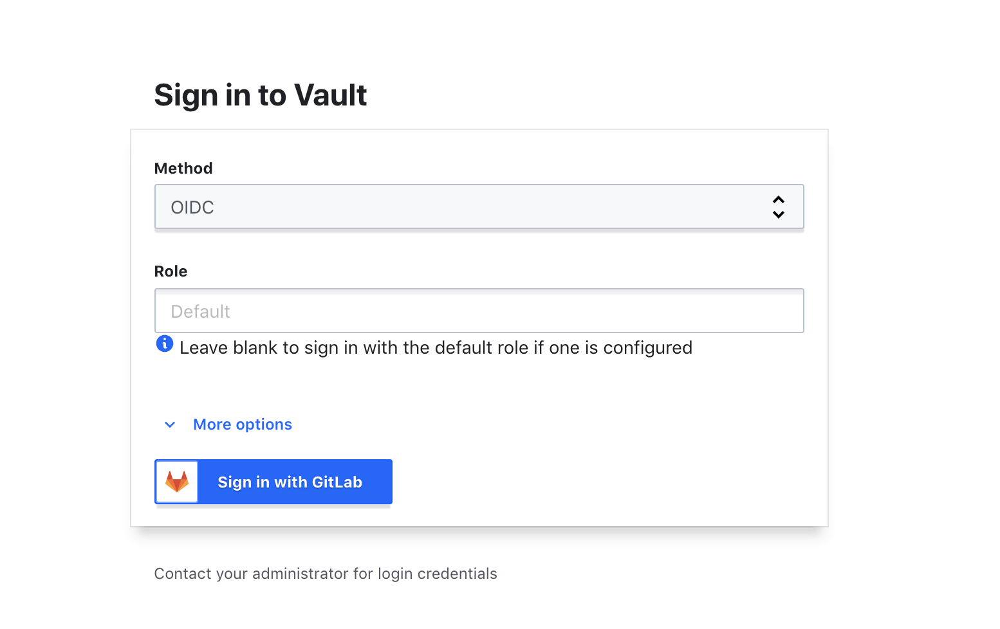
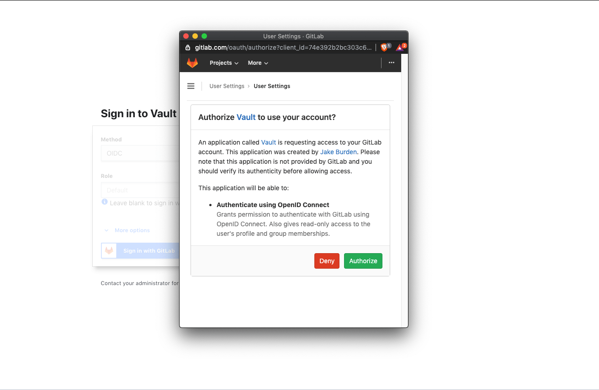
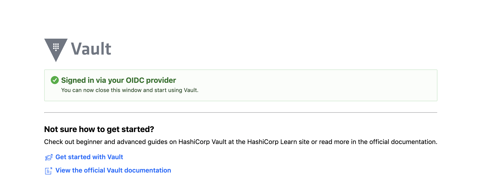

# Vault Authentication with GitLab OpenID Connect

> [Introduced](https://gitlab.com/gitlab-org/gitlab-foss/-/issues/22323) in GitLab 9.0

[Vault](https://www.vaultproject.io/) is a secrets management application offered by HashiCorp.
It allows you to store and manage sensitive information such as secret environment variables, encryption keys, and authentication tokens.
Vault offers Identity-based Access, which means Vault users can authenticate through several of their preferred cloud providers.

This document explains how Vault users can authenticate themselves through GitLab by utilizing our OpenID authentication feature.
The following assumes you already have Vault installed and running.

1. **Get the OpenID Connect client ID and secret from GitLab:**

   First you must create a GitLab application to obtain an application ID and secret for authenticating into Vault.
   To do this, sign in to GitLab and follow these steps:

   1. In the top-right corner, select your avatar.
   1. Select **Edit profile**.
   1. On the left sidebar, select **Applications**.
   1. Fill out the application **Name** and [**Redirect URI**](https://www.vaultproject.io/docs/auth/jwt#redirect-uris).
   1. Select the **OpenID** scope.
   1. Select **Save application**.
   1. Copy client ID and secret, or keep the page open for reference.

   

1. **Enable OIDC auth on Vault:**

   OpenID Connect is not enabled in Vault by default. This needs to be enabled in the terminal.

   Open a terminal session and run the following command to enable the OpenID Connect authentication provider in Vault:

   ```shell
   vault auth enable oidc
   ```

   You should see the following output in the terminal:

   ```plaintext
   Success! Enabled oidc auth method at: oidc/
   ```

1. **Write the OIDC configuration:**

   Next, Vault needs to be given the application ID and secret generated by GitLab.

   In the terminal session, run the following command to give Vault access to the GitLab application you've just created with an OpenID scope. This allows Vault to authenticate through GitLab.

   Replace `your_application_id` and `your_secret` in the example below with the application ID and secret generated for your app:

   ```shell
   $ vault write auth/oidc/config \
       oidc_discovery_url="https://gitlab.com" \
       oidc_client_id="your_application_id" \
       oidc_client_secret="your_secret" \
       default_role="demo" \
       bound_issuer="localhost"
   ```

   You should see the following output in the terminal:

   ```shell
   Success! Data written to: auth/oidc/config
   ```

1. **Write the OIDC Role Configuration:**

   Now that Vault has a GitLab application ID and secret, it needs to know the [**Redirect URIs**](https://www.vaultproject.io/docs/auth/jwt#redirect-uris) and scopes given to GitLab during the application creation process. The redirect URIs need to match where your Vault instance is running. The `oidc_scopes` field needs to include the `openid`. Similarly to the previous step, replace `your_application_id` with the generated application ID from GitLab:

   This configuration is saved under the name of the role you are creating. In this case, we are creating a `demo` role. Later, we show how you can access this role through the Vault CLI.

   WARNING:
   If you're using a public GitLab instance (GitLab.com or any other instance publicly
   accessible), it's paramount to specify the `bound_claims` to allow access only to
   members of your group/project. Otherwise, anyone with a public account can access
   your Vault instance.

   ```shell
   vault write auth/oidc/role/demo -<<EOF
   {
      "user_claim": "sub",
      "allowed_redirect_uris": "your_vault_instance_redirect_uris",
      "bound_audiences": "your_application_id",
      "oidc_scopes": "openid",
      "role_type": "oidc",
      "policies": "demo",
      "ttl": "1h",
      "bound_claims": { "groups": ["yourGroup/yourSubgrup"] }
   }
   EOF
   ```

1. **Sign in to Vault:**

   1. Go to your Vault UI (example: [http://127.0.0.1:8200/ui/vault/auth?with=oidc](http://127.0.0.1:8200/ui/vault/auth?with=oidc)).
   1. If the `OIDC` method is not currently selected, open the dropdown and select it.
   1. Click the **Sign in With GitLab** button, which opens a modal window:

      

   1. Click **Authorize** on the modal to allow Vault to sign in through GitLab. This redirects you back to your Vault UI as a signed-in user.

      

1. **Sign in using the Vault CLI** (optional):

   Vault also allows you to sign in via their CLI.

   After writing the same configurations from above, you can run the command below in your terminal to sign in with the role configuration created in step 4 above:

   ```shell
   vault login -method=oidc port=8250 role=demo
   ```

   Here's a short explanation of what this command does:

   1. In the **Write the OIDC Role Configuration** (step 4), we created a role called
      `demo`. We set `role=demo` so Vault knows which configuration we'd like to
      sign in with.
   1. To set Vault to use the `OIDC` sign-in method, we set `-method=oidc`.
   1. To set the port that GitLab should redirect to, we set `port=8250` or
      another port number that matches the port given to GitLab when listing
      [Redirect URIs](https://www.vaultproject.io/docs/auth/jwt#redirect-uris).

   After running the command, it presents a link in the terminal.
   Click the link in the terminal and a browser tab opens that confirms you're signed into Vault via OIDC:

   

   The terminal outputs:

   ```plaintext
   Success! You are now authenticated. The token information displayed below
   is already stored in the token helper. You do NOT need to run "vault login"
   again. Future Vault requests will automatically use this token.
   ```
