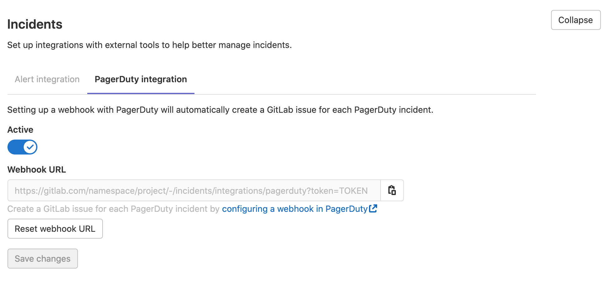

# Incident management

GitLab offers solutions for handling incidents in your applications and services,
such as [setting up Prometheus alerts](#configure-prometheus-alerts),
[displaying metrics](#embed-metrics-in-incidents-and-issues), and sending notifications.
While no configuration is required to use the [manual features](#create-an-incident-manually)
of incident management, both automation and [configuration](#configure-incidents-ultimate)
of incident management are only available in
[GitLab Ultimate and GitLab.com Gold](https://about.gitlab.com/pricing/).

For users with at least Developer [permissions](../../user/permissions.md), the
Incident Management list is available at **Operations > Incidents**
in your project's sidebar. The list contains the following metrics:

- **Incident** - The description of the incident, which attempts to capture the
  most meaningful data.
- **Date created** - How long ago the incident was created. This field uses the
  standard GitLab pattern of `X time ago`, but is supported by a granular date/time
  tooltip depending on the user's locale.
- **Assignees** - The user assigned to the incident.

NOTE: **Note:**
Incidents share the [Issues API](../../user/project/issues/index.md).

## Create an incident manually

> [Moved](https://gitlab.com/gitlab-org/monitor/health/-/issues/24) to GitLab core in 13.3.

For users with at least Developer [permissions](../../user/permissions.md), to create a Incident you can take any of the following actions:

- Navigate to **Operations > Incidents** and click **Create Incident**.
- Create a new issue using the `incident` template available when creating it.
- Create a new issue and assign the `incident` label to it.

## Configure incidents **(ULTIMATE)**

> [Introduced](https://gitlab.com/gitlab-org/gitlab/-/issues/4925) in GitLab Ultimate 11.11.

With Maintainer or higher [permissions](../../user/permissions.md), you can enable or disable Incident Management features in the GitLab user interface
to create issues when alerts are triggered:

1. Navigate to **Settings > Operations > Incidents** and expand
   **Incidents**:

   

1. For GitLab versions 11.11 and greater, you can select the **Create an issue**
   checkbox to create an issue based on your own
   [issue templates](../../user/project/description_templates.md#creating-issue-templates).
   For more information, see
   [Trigger actions from alerts](../metrics/alerts.md#trigger-actions-from-alerts-ultimate) **(ULTIMATE)**.
1. To create issues from alerts, select the template in the **Issue Template**
   select box.
1. To send [separate email notifications](#notify-developers-of-alerts) to users
   with [Developer permissions](../../user/permissions.md), select
   **Send a separate email notification to Developers**.
1. Click **Save changes**.

Appropriately configured alerts include an
[embedded chart](../metrics/embed.md#embedding-metrics-based-on-alerts-in-incident-issues)
for the query corresponding to the alert. You can also configure GitLab to
[close issues](../metrics/alerts.md#trigger-actions-from-alerts-ultimate)
when you receive notification that the alert is resolved.

### Notify developers of alerts

GitLab can react to the alerts triggered from your applications and services
by creating issues and alerting developers through email. By default, GitLab
sends these emails to [owners and maintainers](../../user/permissions.md) of the project.
These emails contain details of the alert, and a link for more information.

To send separate email notifications to users with
[Developer permissions](../../user/permissions.md), see [Configure incidents](#configure-incidents-ultimate).

## Configure PagerDuty integration

> [Introduced](https://gitlab.com/gitlab-org/gitlab/-/issues/119018) in GitLab 13.3.

You can set up a webhook with PagerDuty to automatically create a GitLab issue
for each PagerDuty incident. This configuration requires you to make changes
in both PagerDuty and GitLab:

1. Sign in as a user with Maintainer [permissions](../../user/permissions.md).
1. Navigate to **Settings > Operations > Incidents** and expand **Incidents**.
1. Select the **PagerDuty integration** tab:

   

1. Activate the integration, and save the changes in GitLab.
1. Copy the value of **Webhook URL** for use in a later step.
1. Follow the steps described in the
   [PagerDuty documentation](https://support.pagerduty.com/docs/webhooks)
   to add the webhook URL to a PagerDuty webhook integration.

To confirm the integration is successful, trigger a test incident from PagerDuty to
confirm that a GitLab issue is created from the incident.

## Configure Prometheus alerts

You can set up Prometheus alerts in:

- [GitLab-managed Prometheus](../metrics/alerts.md) installations.
- [Self-managed Prometheus](../metrics/alerts.md#external-prometheus-instances) installations.

Prometheus alerts are created by the special Alert Bot user. You can't remove this
user, but it does not count toward your license limit.

## Configure external generic alerts

GitLab can accept alerts from any source through a generic webhook receiver. When
[configuring the generic alerts integration](../../user/project/integrations/generic_alerts.md),
GitLab creates a unique endpoint which receives a JSON-formatted, customizable payload.

## Embed metrics in incidents and issues

You can embed metrics anywhere [GitLab Markdown](../../user/markdown.md) is used, such as descriptions,
comments on issues, and merge requests. Embedding metrics helps you share them
when discussing incidents or performance issues. You can output the dashboard directly
into any issue, merge request, epic, or any other Markdown text field in GitLab
by [copying and pasting the link to the metrics dashboard](../metrics/embed.md#embedding-gitlab-managed-kubernetes-metrics).

You can embed both
[GitLab-hosted metrics](../metrics/embed.md) and
[Grafana metrics](../metrics/embed_grafana.md)
in incidents and issue templates.

### Context menu

You can view more details about an embedded metrics panel from the context menu.
To access the context menu, click the **{ellipsis_v}** **More actions** dropdown box
above the upper right corner of the panel. For a list of options, see
[Chart context menu](../metrics/dashboards/index.md#chart-context-menu).

#### View logs from metrics panel

> - [Introduced](https://gitlab.com/gitlab-org/gitlab/-/issues/201846) in GitLab Ultimate 12.8.
> - [Moved](https://gitlab.com/gitlab-org/gitlab/-/merge_requests/25455) to [GitLab Core](https://about.gitlab.com/pricing/) 12.9.

Viewing logs from a metrics panel can be useful if you're triaging an application
incident and need to [explore logs](../metrics/dashboards/index.md#chart-context-menu)
from across your application. These logs help you understand what is affecting
your application's performance and resolve any problems.

## Integrate incidents with Slack

Slack slash commands allow you to control GitLab and view GitLab content without leaving Slack.

Learn how to [set up Slack slash commands](../../user/project/integrations/slack_slash_commands.md)
and how to [use the available slash commands](../../integration/slash_commands.md).

## Integrate issues with Zoom

GitLab enables you to [associate a Zoom meeting with an issue](../../user/project/issues/associate_zoom_meeting.md)
for synchronous communication during incident management. After starting a Zoom
call for an incident, you can associate the conference call with an issue. Your
team members can join the Zoom call without requesting a link.
