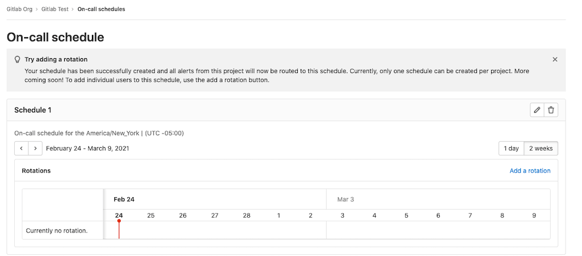

# On-call Schedule Management **(PREMIUM)**

> [Introduced](https://gitlab.com/groups/gitlab-org/-/epics/4544) in [GitLab Premium](https://about.gitlab.com/pricing/) 13.11.

Use on-call schedule management to create schedules for responders to rotate on-call
responsibilities. Maintain the availability of your software services by putting your teams on-call.
With an on-call schedule, your team is notified immediately when things go wrong so they can quickly
respond to service outages and disruptions.

To use on-call schedules:

1. [Create a schedule](#schedules).
1. [Add a rotation to the schedule](#rotations).

## Schedules

Set up an on-call schedule for your team to add rotations to.

Prerequisite:

- You must have at least the Maintainer [role](../../user/permissions.md).

To create an on-call schedule:

1. On the top bar, select **Menu > Projects** and find your project.
1. On the left sidebar, select **Monitor > On-call Schedules**.
1. Select **Add a schedule**.
1. Enter the schedule's name and description and select a time zone.
1. Select **Add schedule**.

You now have an empty schedule with no rotations. This renders as an empty state, prompting you to
create [rotations](#rotations) for your schedule.

### Edit a schedule

To update a schedule:

1. On the top bar, select **Menu > Projects** and find your project.
1. On the left sidebar, select **Monitor > On-call Schedules**.
1. Select **Edit schedule** (**{pencil}**).
1. Edit the information.
1. Select **Save changes**.

If you change the schedule's time zone, GitLab automatically updates the rotation's restricted time
interval (if one is set) to the corresponding times in the new time zone.

### Delete a schedule

To delete a schedule:

1. On the top bar, select **Menu > Projects** and find your project.
1. On the left sidebar, select **Monitor > On-call Schedules**.
1. Select **Delete escalation policy** (**{remove}**).
1. On the confirmation dialog, select **Delete schedule**.

## Rotations

Add rotations to an existing schedule to put your team members on-call.

To create a rotation:

1. On the top bar, select **Menu > Projects** and find your project.
1. On the left sidebar, select **Monitor > On-call Schedules**.
1. Select the **Add a rotation** link.
1. Enter the following information:

   - **Name:** Your rotation's name.
   - **Participants:** The people you want in the rotation.
   - **Rotation length:** The rotation's duration.
   - **Starts on:** The date and time the rotation begins.
   - **Enable end date:** With the toggle on, you can select the date and time your rotation
     ends.
   - **Restrict to time intervals:** With the toggle on, you can restrict your rotation to the
     time period you select.

### Edit a rotation

To edit a rotation:

1. On the top bar, select **Menu > Projects** and find your project.
1. On the left sidebar, select **Monitor > On-call Schedules**.
1. In the **Rotations** section, select **Edit rotation** (**{pencil}**).
1. Edit the information.
1. Select **Save changes**.

### Delete a rotation

To delete a rotation:

1. On the top bar, select **Menu > Projects** and find your project.
1. On the left sidebar, select **Monitor > On-call Schedules**.
1. In the **Rotations** section, select **Delete rotation** (**{remove}**).
1. On the confirmation dialog, select **Delete rotation**.

## View schedule rotations

You can view the on-call schedules of a single day or two weeks. To switch between these time
periods, select the **1 day** or **2 weeks** buttons on the schedule. Two weeks is the default view.

Hover over any rotation shift participants in the schedule to view their individual shift details.

## Page an on-call responder

When an alert is created in a project, GitLab sends an email to the on-call responder(s) in the
on-call schedule for that project. If there is no schedule or no one on-call in that schedule at the
time the alert is triggered, no email is sent.

## Removal or deletion of on-call user

If an on-call user is removed from the project or group, or their account is deleted, the
confirmation modal displays the list of that user's on-call schedules. If the user's removal or
deletion is confirmed, GitLab recalculates the on-call rotation and sends an email to the project
owners and the rotation's participants.
