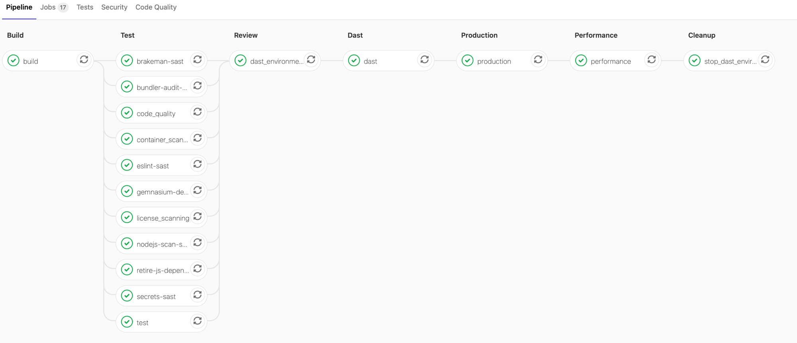
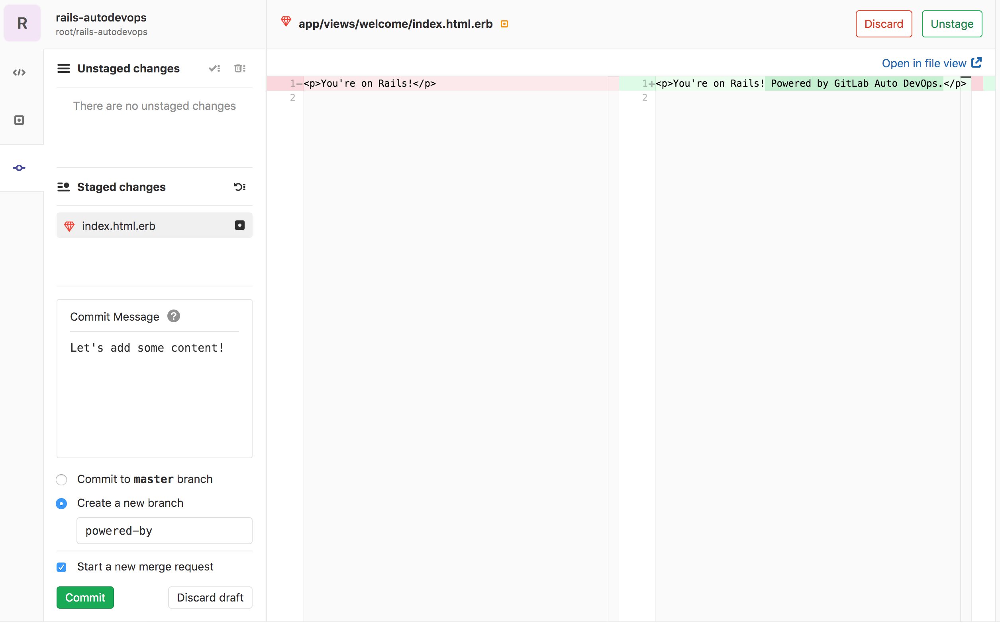

# Use Auto DevOps to deploy an application to Amazon Elastic Kubernetes Service (EKS)

In this tutorial, we'll help you to get started with [Auto DevOps](../index.md)
through an example of how to deploy an application to Amazon Elastic Kubernetes Service (EKS).

The tutorial uses the GitLab native Kubernetes integration, so you don't need
to create a Kubernetes cluster manually using the AWS console.

You can also follow this tutorial on a self-managed instance.
Ensure your own [runners are configured](../../../ci/runners/index.md).

To deploy a project to EKS:

1. [Configure your Amazon account](#configure-your-amazon-account)
1. [Create a Kubernetes cluster and deploy the agent](#create-a-kubernetes-cluster)
1. [Create a new project from a template](#create-an-application-project-from-a-template)
1. [Configure the agent](#configure-the-agent)
1. [Install Ingress](#install-ingress)
1. [Configure Auto DevOps](#configure-auto-devops)
1. [Enable Auto DevOps and run the pipeline](#enable-auto-devops-and-run-the-pipeline)
1. [Deploy the application](#deploy-the-application)

## Configure your Amazon account

Before you create and connect your Kubernetes cluster to your GitLab project,
you need an [Amazon Web Services account](https://https://aws.amazon.com/).
Sign in with an existing Amazon account or create a new one.

## Create a Kubernetes cluster

To create an new cluster on Amazon EKS:

- Follow the steps in [Create an Amazon EKS cluster](../../../user/infrastructure/clusters/connect/new_eks_cluster.md).

If you prefer, you can also create a cluster manually using `eksctl`.

## Create an application project from a template

Use a GitLab project template to get started. As the name suggests,
those projects provide a bare-bones application built on some well-known frameworks.

WARNING:
Create the application project in the group hierarchy at the same level or below the project for cluster management. Otherwise, it fails to [authorize the agent](../../../user/clusters/agent/ci_cd_workflow.md#authorize-the-agent).

1. On the top bar in GitLab, select the plus icon (**{plus-square}**), and select
   **New project/repository**.
1. Select **Create from template**.
1. Select the **Ruby on Rails** template.
1. Give your project a name, optionally a description, and make it public so that
   you can take advantage of the features available in the
   [GitLab Ultimate plan](https://about.gitlab.com/pricing/).
1. Select **Create project**.

Now you have an application project you are going to deploy to the EKS cluster.

## Configure the agent

Next, we'll configure the GitLab agent for Kubernetes so we can use it to deploy the application project.

1. Go to the project [we created to manage the cluster](#create-a-kubernetes-cluster).
1. Navigate to the [agent configuration file](../../../user/clusters/agent/install/index.md#create-an-agent-configuration-file) (`.gitlab/agents/eks-agent/config.yaml`) and edit it.
1. Configure `ci_access:projects` attribute. Use the application project path as `id`:

```yaml
ci_access:
  projects:
    - id: path/to/application-project
```

## Install Ingress

After your cluster is running, you must install NGINX Ingress Controller as a
load balancer to route traffic from the internet to your application.
Install the NGINX Ingress Controller
through the GitLab [Cluster management project template](../../../user/clusters/management_project_template.md),
or manually via the command line:

1. Ensure you have `kubectl` and Helm installed on your machine.
1. Create an IAM role to access the cluster.
1. Create an access token to access the cluster.
1. Use `kubectl` to connect to your cluster:

   ```shell
   helm upgrade --install ingress-nginx ingress-nginx \
   --repo https://kubernetes.github.io/ingress-nginx \
   --namespace gitlab-managed-apps --create-namespace

   # Check that the ingress controller is installed successfully
   kubectl get service ingress-nginx-controller -n gitlab-managed-apps
   ```

## Configure Auto DevOps

Follow these steps to configure the base domain and other settings required for Auto DevOps.

1. A few minutes after you install NGINX, the load balancer obtains an IP address, and you can
   get the external IP address with the following command:

   ```shell
   kubectl get all -n gitlab-managed-apps --selector app.kubernetes.io/instance=ingress-nginx
   ```

   Replace `gitlab-managed-apps` if you have overwritten your namespace.

   Next, find the actual external IP address for your cluster with the following command:

   ```shell
   nslookup [External IP]
   ```

   Where the `[External IP]` is the hostname found with the previous command.

   The IP address might be listed in the `Non-authoritative answer:` section of the response.

   Copy this IP address, as you need it in the next step.

1. Go back to the application project.
1. On the left sidebar, select **Settings > CI/CD** and expand **Variables**.
   - Add a key called `KUBE_INGRESS_BASE_DOMAIN` with the application deployment domain as the value. For this example, use the domain `<IP address>.nip.io`.
   - Add a key called `KUBE_NAMESPACE` with a value of the Kubernetes namespace for your deployments to target. You can use different namespaces per environment. Configure the environment, use the environment scope.
   - Add a key called `KUBE_CONTEXT` with a value like `path/to/agent/project:eks-agent`. Select the environment scope of your choice.
   - Select **Save changes**.

## Enable Auto DevOps and run the pipeline

While Auto DevOps is enabled by default, Auto DevOps can be disabled at both
the instance level (for self-managed instances) and the group level. Complete
these steps to enable Auto DevOps if it's disabled:

1. On the top bar, select **Main menu > Projects** and find the application project.
1. On the left sidebar, select **Settings > CI/CD**.
1. Expand **Auto DevOps**.
1. Select **Default to Auto DevOps pipeline** to display more options.
1. In **Deployment strategy**, select your desired [continuous deployment strategy](../requirements.md#auto-devops-deployment-strategy)
   to deploy the application to production after the pipeline successfully runs on the default branch.
1. Select **Save changes**.
1. Edit `.gitlab-ci.yml` file to include the Auto DevOps template and commit the change to the default branch:

   ```yaml
   include:
   - template: Auto-DevOps.gitlab-ci.yml
   ```

The commit should trigger a pipeline. In the next section, we explain what each job does in the pipeline.

## Deploy the application

When your pipeline runs, what is it doing?

To view the jobs in the pipeline, select the pipeline's status badge. The
**{status_running}** icon displays when pipeline jobs are running, and updates
without refreshing the page to **{status_success}** (for success) or
**{status_failed}** (for failure) when the jobs complete.

The jobs are separated into stages:



- **Build** - The application builds a Docker image and uploads it to your project's
  [Container Registry](../../../user/packages/container_registry/index.md) ([Auto Build](../stages.md#auto-build)).
- **Test** - GitLab runs various checks on the application, but all jobs except `test`
  are allowed to fail in the test stage:

  - The `test` job runs unit and integration tests by detecting the language and
    framework ([Auto Test](../stages.md#auto-test-deprecated))
  - The `code_quality` job checks the code quality and is allowed to fail
    ([Auto Code Quality](../stages.md#auto-code-quality))
  - The `container_scanning` job checks the Docker container if it has any
    vulnerabilities and is allowed to fail ([Auto Container Scanning](../stages.md#auto-container-scanning))
  - The `dependency_scanning` job checks if the application has any dependencies
    susceptible to vulnerabilities and is allowed to fail
    ([Auto Dependency Scanning](../stages.md#auto-dependency-scanning))
  - Jobs suffixed with `-sast` run static analysis on the current code to check for potential
    security issues, and are allowed to fail ([Auto SAST](../stages.md#auto-sast))
  - The `secret-detection` job checks for leaked secrets and is allowed to fail ([Auto Secret Detection](../stages.md#auto-secret-detection))
  - The `license_scanning` job searches the application's dependencies to determine each of their
    licenses and is allowed to fail
    ([Auto License Compliance](../stages.md#auto-license-compliance))

- **Review** - Pipelines on the default branch include this stage with a `dast_environment_deploy` job.
  To learn more, see [Dynamic Application Security Testing (DAST)](../../../user/application_security/dast/index.md).

- **Production** - After the tests and checks finish, the application deploys in
  Kubernetes ([Auto Deploy](../stages.md#auto-deploy)).

- **Performance** - Performance tests are run on the deployed application
  ([Auto Browser Performance Testing](../stages.md#auto-browser-performance-testing)).

- **Cleanup** - Pipelines on the default branch include this stage with a `stop_dast_environment` job.

After running a pipeline, you should view your deployed website and learn how
to monitor it.

### Monitor your project

After successfully deploying your application, you can view its website and check
on its health on the **Environments** page by navigating to
**Deployments > Environments**. This page displays details about
the deployed applications, and the right-hand column displays icons that link
you to common environment tasks:


- **Open live environment** (**{external-link}**) - Opens the URL of the application deployed in production
- **Monitoring** (**{chart}**) - Opens the metrics page where Prometheus collects data
  about the Kubernetes cluster and how the application
  affects it in terms of memory usage, CPU usage, and latency
- **Deploy to** (**{play}** **{chevron-lg-down}**) - Displays a list of environments you can deploy to
- **Terminal** (**{terminal}**) - Opens a [web terminal](../../../ci/environments/index.md#web-terminals-deprecated)
  session inside the container where the application is running
- **Re-deploy to environment** (**{repeat}**) - For more information, see
  [Retrying and rolling back](../../../ci/environments/index.md#retry-or-roll-back-a-deployment)
- **Stop environment** (**{stop}**) - For more information, see
  [Stopping an environment](../../../ci/environments/index.md#stop-an-environment)

GitLab displays the [deploy board](../../../user/project/deploy_boards.md) below the
environment's information, with squares representing pods in your
Kubernetes cluster, color-coded to show their status. Hovering over a square on
the deploy board displays the state of the deployment, and selecting the square
takes you to the pod's logs page.

Although the example shows only one pod hosting the application at the moment, you can add
more pods by defining the [`REPLICAS` CI/CD variable](../cicd_variables.md)
in **Settings > CI/CD > Variables**.

### Work with branches

Following the [GitLab flow](../../gitlab_flow.md#working-with-feature-branches),
you should next create a feature branch to add content to your application:

1. In your project's repository, go to the following file: `app/views/welcome/index.html.erb`.
   This file should only contain a paragraph: `<p>You're on Rails!</p>`.
1. Open the GitLab [Web IDE](../../../user/project/web_ide/index.md) to make the change.
1. Edit the file so it contains:

   ```html
   <p>You're on Rails! Powered by GitLab Auto DevOps.</p>
   ```

1. Stage the file. Add a commit message, then create a new branch and a merge request
   by selecting **Commit**.

   

After submitting the merge request, GitLab runs your pipeline, and all the jobs
in it, as [described previously](#deploy-the-application), in addition to
a few more that run only on branches other than the default branch.

After a few minutes a test fails, which means a test was
'broken' by your change. Select the failed `test` job to see more information
about it:

```plaintext
Failure:
WelcomeControllerTest#test_should_get_index [/app/test/controllers/welcome_controller_test.rb:7]:
<You're on Rails!> expected but was
<You're on Rails! Powered by GitLab Auto DevOps.>..
Expected 0 to be >= 1.

bin/rails test test/controllers/welcome_controller_test.rb:4
```

To fix the broken test:

1. Return to your merge request.
1. In the upper right corner, select **Code**, then select **Open in Gitpod**.
1. In the left-hand directory of files, find the `test/controllers/welcome_controller_test.rb`
   file, and select it to open it.
1. Change line 7 to say `You're on Rails! Powered by GitLab Auto DevOps.`
1. Select **Commit**.
1. In the left-hand column, under **Unstaged changes**, select the checkmark icon
   (**{stage-all}**) to stage the changes.
1. Write a commit message, and select **Commit**.

Return to the **Overview** page of your merge request, and you should not only
see the test passing, but also the application deployed as a
[review application](../stages.md#auto-review-apps). You can visit it by selecting
the **View app** **{external-link}** button to see your changes deployed.

After merging the merge request, GitLab runs the pipeline on the default branch,
and then deploys the application to production.

## Conclusion

After implementing this project, you should have a solid understanding of the basics of Auto DevOps.
You started from building and testing, to deploying and monitoring an application
all in GitLab. Despite its automatic nature, Auto DevOps can also be configured
and customized to fit your workflow. Here are some helpful resources for further reading:

1. [Auto DevOps](../index.md)
1. [Multiple Kubernetes clusters](../multiple_clusters_auto_devops.md)
1. [Incremental rollout to production](../cicd_variables.md#incremental-rollout-to-production)
1. [Disable jobs you don't need with CI/CD variables](../cicd_variables.md)
1. [Use your own buildpacks to build your application](../customize.md#custom-buildpacks)
1. [Prometheus monitoring](../../../user/project/integrations/prometheus.md)
