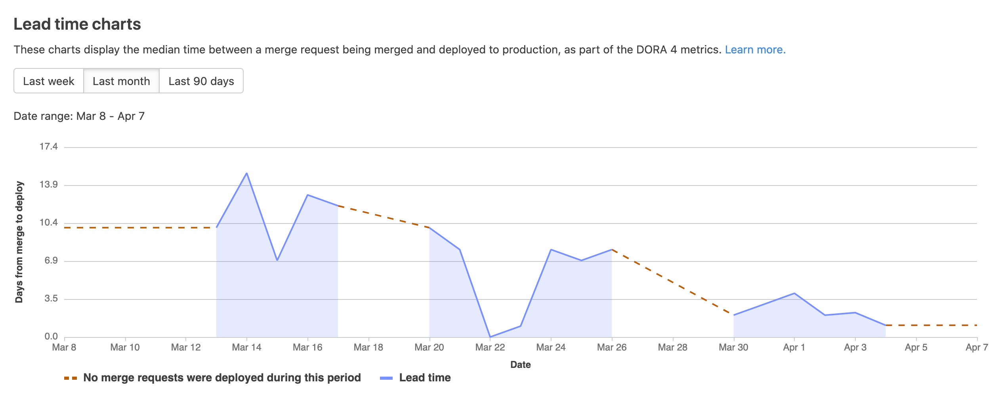
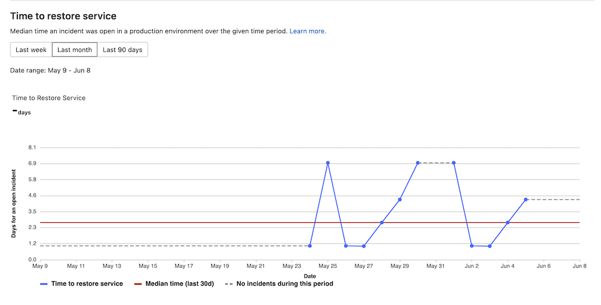

# CI/CD analytics **(FREE)**

Use the CI/CD analytics page to view pipeline success rates and duration, and the history of DORA metrics over time.

## Pipeline success and duration charts

CI/CD analytics shows the history of your pipeline successes and failures, as well as how long each pipeline
ran.

Pipeline statistics are gathered by collecting all available pipelines for the
project, regardless of status. The data available for each individual day is based
on when the pipeline was created.

The total pipeline calculation includes child
pipelines and pipelines that failed with an invalid YAML. To filter pipelines based on other attributes, use the [Pipelines API](../../api/pipelines.md#list-project-pipelines).

View successful pipelines:

View pipeline duration history:

## View CI/CD analytics

To view CI/CD analytics:

1. On the top bar, select **Main menu > Projects** and find your project.
1. On the left sidebar, select **Analytics > CI/CD Analytics**.

## View DORA deployment frequency chart **(ULTIMATE)**

> [Introduced](https://gitlab.com/gitlab-org/gitlab/-/issues/275991) in GitLab 13.8.

The [deployment frequency](dora_metrics.md#deployment-frequency) charts show information about the deployment
frequency to the `production` environment. The environment must be part of the
[production deployment tier](../../ci/environments/index.md#deployment-tier-of-environments)
for its deployment information to appear on the graphs.

  Deployment frequency is one of the four DORA metrics that DevOps teams use for measuring excellence in software delivery.

The deployment frequency chart is available for groups and projects.

To view the deployment frequency chart:

1. On the top bar, select **Main menu > Projects** and find your project.
1. On the left sidebar, select **Analytics > CI/CD Analytics**.
1. Select the **Deployment frequency** tab.

## View DORA lead time for changes chart **(ULTIMATE)**

> [Introduced](https://gitlab.com/gitlab-org/gitlab/-/issues/250329) in GitLab 13.11.

The [lead time for changes](dora_metrics.md#lead-time-for-changes) chart shows information about how long it takes for
merge requests to be deployed to a production environment. This chart is available for groups and projects.

- Small lead times indicate fast, efficient deployment
  processes.
- For time periods in which no merge requests were deployed, the charts render a
  red, dashed line.

  Lead time for changes is one of the four DORA metrics that DevOps teams use for measuring excellence in software delivery.

To view the lead time for changes chart:

1. On the top bar, select **Main menu > Projects** and find your project.
1. On the left sidebar, select **Analytics > CI/CD Analytics**.
1. Select the **Lead time** tab.

## View DORA time to restore service chart **(ULTIMATE)**

> [Introduced](https://gitlab.com/gitlab-org/gitlab/-/issues/356959) in GitLab 15.1

The [time to restore service](dora_metrics.md#time-to-restore-service) chart shows information about the median time an incident was open in a production environment. This chart is available for groups and projects.

Time to restore service is one of the four DORA metrics that DevOps teams use for measuring excellence in software delivery.

To view the time to restore service chart:

1. On the top bar, select **Main menu > Projects** and find your project.
1. On the left sidebar, select **Analytics > CI/CD Analytics**.
1. Select the **Time to restore service** tab.

## View DORA change failure rate chart **(ULTIMATE)**

> [Introduced](https://gitlab.com/gitlab-org/gitlab/-/issues/357072) in GitLab 15.2

The [change failure rate](dora_metrics.md#change-failure-rate) chart shows information about the percentage of deployments that cause an incident in a production environment. This chart is available for groups and projects.

Change failure rate is one of the four DORA metrics that DevOps teams use for measuring excellence in software delivery.

To view the change failure rate chart:

1. On the top bar, select **Main menu > Projects** and find your project.
1. On the left sidebar, select **Analytics > CI/CD Analytics**.
1. Select the **Change failure rate** tab.
