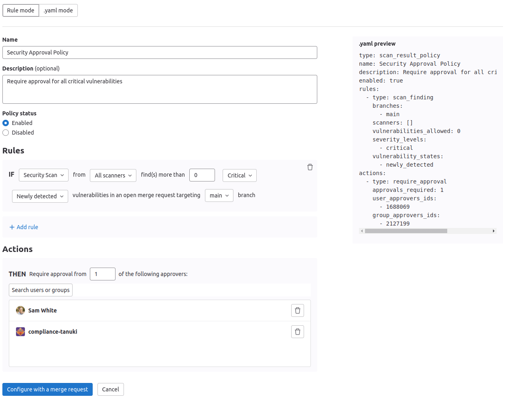
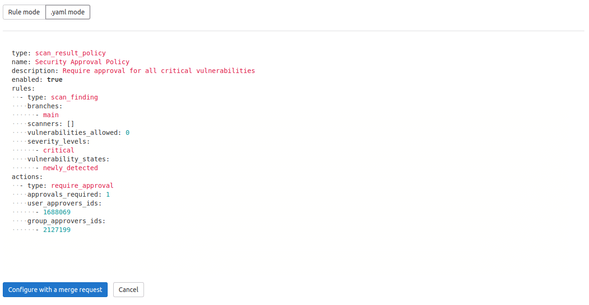

# Policies **(ULTIMATE)**

> - [Introduced](https://gitlab.com/groups/gitlab-org/-/epics/5329) in GitLab 13.10 with a flag named `security_orchestration_policies_configuration`. Disabled by default.
> - [Enabled on self-managed](https://gitlab.com/gitlab-org/gitlab/-/issues/321258) in GitLab 14.3.
> - [Feature flag removed](https://gitlab.com/gitlab-org/gitlab/-/issues/321258) in GitLab 14.4.

Policies in GitLab provide security teams a way to require scans of their choice to be run
whenever a project pipeline runs according to the configuration specified. Security teams can
therefore be confident that the scans they set up have not been changed, altered, or disabled. You
can access these by navigating to your project's **Security and Compliance > Policies** page.

GitLab supports the following security policies:

- [Scan Execution Policy](scan-execution-policies.md)
- [Scan Result Policy](scan-result-policies.md)

## Security policy project

All security policies are stored as YAML in a separate security policy project that gets linked to
the development project, group, or sub-group. This association can be a one-to-many relationship, allowing one security
policy project to apply to multiple development projects, groups, or sub-groups:

- For self-managed GitLab instances, linked projects are not required to be in the same group
  or the same subgroup as the development projects to which they are linked.
- For GitLab SaaS, the security policy project is required to be in the same top-level group
  as the development project, although, it is not necessary for the project to be in the same subgroup.

Although it is possible to have one project linked to itself and to serve as both the development
project and the security policy project, this is not recommended. Keeping the security policy
project separate from the development project allows for complete separation of duties between
security/compliance teams and development teams.

All security policies are stored in the `.gitlab/security-policies/policy.yml` YAML file inside the
linked security policy project. The format for this YAML is specific to the type of policy that is
stored there. Examples and schema information are available for the following policy types:

- [Scan execution policy](scan-execution-policies.md#example-security-policies-project)
- [Scan result policy](scan-result-policies.md#example-security-scan-result-policies-project)

Most policy changes take effect as soon as the merge request is merged. Any changes that
do not go through a merge request and are committed directly to the default branch may require up to 10 minutes
before the policy changes take effect.

### Managing the linked security policy project

NOTE:
Only project Owners have the [permissions](../../permissions.md#project-members-permissions)
to select, edit, and unlink a security policy project.

As a project owner, take the following steps to create or edit an association between your current
project and a project that you would like to designate as the security policy project:

1. On the left sidebar, at the top, select **Search GitLab** (**{search}**) to find your project.
1. Select **Secure > Policies**.
1. Select **Edit Policy Project**, and search for and select the
   project you would like to link from the dropdown list.
1. Select **Save**.

To unlink a security policy project, follow the same steps but instead select the trash can icon in
the modal.

### Viewing the linked security policy project

All users who have access to the project policy page and are not project owners will instead view a
button linking out to the associated security policy project. If no security policy project has been
associated then the linking button does not appear.

## Policy management

The Policies page displays deployed
policies for all available environments. You can check a
policy's information (for example, description or enforcement
status), and create and edit deployed policies:

1. On the left sidebar, at the top, select **Search GitLab** (**{search}**) to find your project.
1. Select **Secure > Policies**.

## Policy editor

> [Introduced](https://gitlab.com/groups/gitlab-org/-/epics/3403) in GitLab 13.4.

You can use the policy editor to create, edit, and delete policies:

1. On the left sidebar, at the top, select **Search GitLab** (**{search}**) to find your project.
1. Select **Secure > Policies**.
   - To create a new policy, select **New policy** which is located in the **Policies** page's header.
     You can then select which type of policy to create.
   - To edit an existing policy, select **Edit policy** in the selected policy drawer.

The policy editor has two modes:

- The visual _Rule_ mode allows you to construct and preview policy
  rules using rule blocks and related controls.

  

- YAML mode allows you to enter a policy definition in `.yaml` format
  and is aimed at expert users and cases that the Rule mode doesn't
  support.

  

You can use both modes interchangeably and switch between them at any
time. If a YAML resource is incorrect or contains data not supported
by the Rule mode, Rule mode is automatically
disabled. If the YAML is incorrect, you must use YAML
mode to fix your policy before Rule mode is available again.

When you finish creating or editing your policy, save and apply it by selecting the
**Configure with a merge request** button and then merging the resulting merge request. When you
press this button, the policy YAML is validated and any resulting errors are displayed.
Additionally, if you are a project owner and a security policy project has not been previously
associated with this project, then a new project is created and associated automatically at the same
time that the first policy merge request is created.

## Managing projects in bulk via a script

You can use the [Vulnerability-Check Migration](https://gitlab.com/gitlab-org/gitlab/-/snippets/2328089) script to bulk create policies or associate security policy projects with development projects. For instructions and a demonstration of how to use the Vulnerability-Check Migration script, see [this video](https://youtu.be/biU1N26DfBc).

## Troubleshooting

### `Branch name 'update-policy-<timestamp>' does not follow the pattern '<branch_name_regex>'`

When you create a new security policy or change an existing policy, a new branch is automatically created with the branch name following the pattern `update-policy-<timestamp>`. For example: `update-policy-1659094451`.

If you have group or instance [push rules that do not allow branch name patterns](../../project/repository/push_rules.md#validate-branch-names) that contain the text `update-policy-<timestamp>`, you will get an error that states `Branch name 'update-policy-<timestamp>' does not follow the pattern '<branch_name_regex>'`.

The workaround is to amend your group or instance push rules to allow branches following the pattern `update-policy-` followed by an integer timestamp.

### Troubleshooting common issues configuring security policies

- Confirm that projects contain a `.gitlab-ci.yml` file. This file is required for scan execution policies.
- Confirm that scanners are properly configured and producing results for the latest branch. Security Policies are designed to require approval when there are no results (no security report), as this ensures that no vulnerabilities are introduced. We cannot know if there are any vulnerabilities unless the scans enforced by the policy complete successfully and are evaluated.
- When running scan execution policies based on a SAST action, ensure target repositories contain proper code files. SAST runs different analyzers [based on the types of files in the repo](../sast/index.md#supported-languages-and-frameworks), and if no supported files are found it will not run any jobs. See the [SAST CI template](https://gitlab.com/gitlab-org/gitlab/-/blob/master/lib/gitlab/ci/templates/Jobs/SAST.gitlab-ci.yml) for more details.
- Check for any branch configuration conflicts. If your policy is configured to enforce rules on `main` but some projects within the scope are using `master` as their default branch, the policy is not applied for the latter. Support for specifying the `default` branch in your policies is proposed in [epic 9468](https://gitlab.com/groups/gitlab-org/-/epics/9468).
- Scan result policies created at the group or sub-group level can take some time to apply to all the merge requests in the group.
- Scheduled scan execution policies run with a minimum 15 minute cadence. Learn more [about the schedule rule type](../policies/scan-execution-policies.md#schedule-rule-type).
- When scheduling pipelines, keep in mind that CRON scheduling is based on UTC on GitLab SaaS and is based on your server time for self managed instances. When testing new policies, it may appear pipelines are not running properly when in fact they are scheduled in your server's timezone.
- When enforcing scan execution policies, the target project's pipeline is triggered by the user who last updated the security policy project's `policy.yml` file. The user must have permission to trigger the pipeline in the project for the policy to be enforced, and the pipeline to run. Work to address this is being tracked in [issue 394958](https://gitlab.com/gitlab-org/gitlab/-/issues/394958).
- You should not link a security policy project to a development project and to the group or sub-group the development project belongs to at the same time. Linking this way will result in approval rules from the Scan Result Policy not being applied to merge requests in the development project.
- When creating a Scan Result Policy, neither the array `severity_levels` nor the array `vulnerability_states` in the [scan_finding rule](../policies/scan-result-policies.md#scan_finding-rule-type) can be left empty; for a working rule, at least one entry must exist.

If you are still experiencing issues, you can [view recent reported bugs](https://gitlab.com/gitlab-org/gitlab/-/issues/?sort=popularity&state=opened&label_name%5B%5D=group%3A%3Asecurity%20policies&label_name%5B%5D=type%3A%3Abug&first_page_size=20) and raise new unreported issues.
