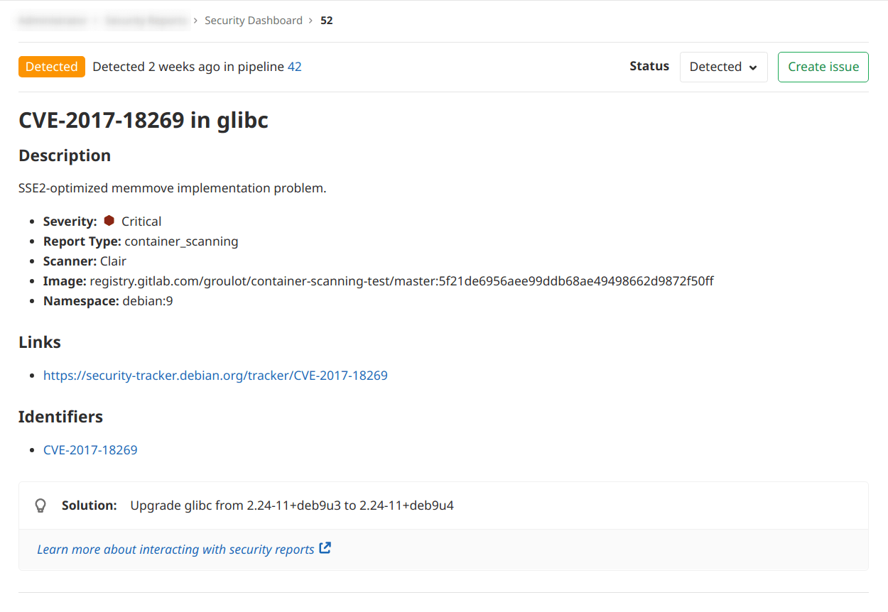

# Standalone Vulnerability pages

> [Introduced](https://gitlab.com/gitlab-org/gitlab/-/issues/13561) in [GitLab Ultimate](https://about.gitlab.com/pricing/) 13.0.

Each security vulnerability in the [Security Dashboard](../security_dashboard/index.md#project-security-dashboard) has its own standalone
page.

On the standalone vulnerability page, you can interact with the vulnerability in
several different ways:

- [Change the Vulnerability Status](#changing-vulnerability-status) - You can change the
  status of a vulnerability to **Detected**, **Confirmed**, **Dismissed**, or **Resolved**.
- [Create issue](#creating-an-issue-for-a-vulnerability) - Create a new issue with the
  title and description pre-populated with information from the vulnerability report.
  By default, such issues are [confidential](../../project/issues/confidential_issues.md).
- [Solution](#automatic-remediation-solutions-for-vulnerabilities) - For some vulnerabilities,
  a solution is provided for how to fix the vulnerability.

## Changing vulnerability status

You can switch the status of a vulnerability using the **Status** dropdown to one of
the following values:

| State     | Description                                                       |
|-----------|-------------------------------------------------------------------|
| Detected  | The default state for a newly discovered vulnerability            |
| Confirmed | A user has seen this vulnerability and confirmed it to be real    |
| Dismissed | A user has seen this vulnerability and dismissed it               |
| Resolved  | The vulnerability has been fixed and is no longer in the codebase |

## Creating an issue for a vulnerability

You can create an issue for a vulnerability by selecting the **Create issue** button.

This creates a [confidential issue](../../project/issues/confidential_issues.md) in the
project the vulnerability came from, and pre-populates it with useful information from
the vulnerability report. After the issue is created, GitLab redirects you to the
issue page so you can edit, assign, or comment on the issue.

## Automatic remediation solutions for vulnerabilities

You can fix some vulnerabilities by applying the solution that GitLab automatically
generates for you. GitLab supports the following scanners:

- [Dependency Scanning](../dependency_scanning/index.md): Automatic Patch creation
  is only available for Node.js projects managed with  `yarn`.
- [Container Scanning](../container_scanning/index.md).

### Manually applying a suggested patch

To apply a patch automatically generated by GitLab to fix a vulnerability:

1. Open the issue created in [Create issue](#creating-an-issue-for-a-vulnerability).
1. In the **Issue description**, scroll to **Solution** and download the linked patch file.
1. Ensure your local project has the same commit checked out that was used to generate the patch.
1. Run `git apply remediation.patch` to apply the patch.
1. Verify and commit the changes to your branch.

