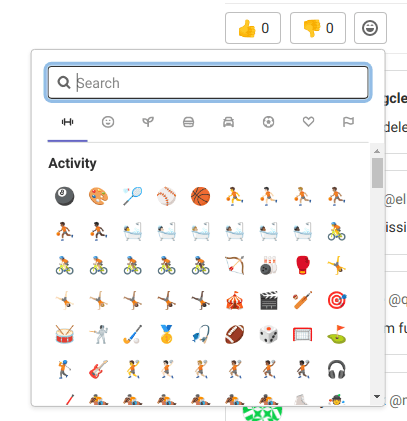
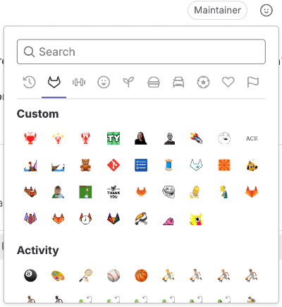

# Emoji reactions **(FREE)**

> - [Renamed](https://gitlab.com/gitlab-org/gitlab/-/issues/409884) from "award emoji" to "emoji reactions" in GitLab 16.0.
> - Reacting with emoji on work items (such as tasks, objectives, and key results) [introduced](https://gitlab.com/gitlab-org/gitlab/-/issues/393599) in GitLab 16.0.

When you're collaborating online, you get fewer opportunities for high-fives
and thumbs-ups. React with emoji on:

- [Issues](project/issues/index.md).
- [Tasks](tasks.md).
- [Merge requests](project/merge_requests/index.md),
[snippets](snippets.md).
- [Epics](../user/group/epics/index.md).
- [Objectives and key results](okrs.md).
- Anywhere else you can have a comment thread.

Emoji reactions make it much easier to give and receive feedback without a long
comment thread.

For information on the relevant API, see [Emoji reactions API](../api/award_emoji.md).

## Sort issues and merge requests on vote count

You can quickly sort issues and merge requests by the number of votes ("thumbs up" and "thumbs down" emoji) they
have received. The sort options can be found in the dropdown list as "Most
popular" and "Least popular".

The total number of votes is not summed up. An issue with 18 upvotes and 5
downvotes is considered more popular than an issue with 17 upvotes and no
downvotes.

## Emoji reactions for comments

Emoji reactions can also be applied to individual comments when you want to
celebrate an accomplishment or agree with an opinion.

To add an emoji reaction:

1. In the upper-right corner of the comment, select the smile (**{slight-smile}**).
1. Select an emoji from the emoji picker.

To remove an emoji reaction, select the emoji again.

## Custom emoji

> - [Introduced for GraphQL API](https://gitlab.com/gitlab-org/gitlab/-/merge_requests/37911) in GitLab 13.6 [with a flag](../administration/feature_flags.md) named `custom_emoji`. Disabled by default.
> - Enabled on GitLab.com in GitLab 14.0.
> - [Added](https://gitlab.com/gitlab-org/gitlab/-/issues/333095) UI to add emoji in GitLab 16.2.

Custom emoji show in the emoji picker everywhere you can react with emoji.
To add an emoji reaction to a comment or description:

1. Select the smile (**{slight-smile}**).
1. Select the GitLab logo (**{tanuki}**) or scroll down to the **Custom** section.
1. Select an emoji from the emoji picker.

To use them in a text box, type the filename between two colons.
For example, `:thank-you:`.

You can upload custom emoji to a GitLab instance with the GraphQL API.
For more information, see [Use custom emoji with GraphQL](../api/graphql/custom_emoji.md).

For a list of custom emoji available for GitLab.com, see
[the `custom_emoji` project](https://gitlab.com/custom_emoji/custom_emoji/-/tree/main/img).
