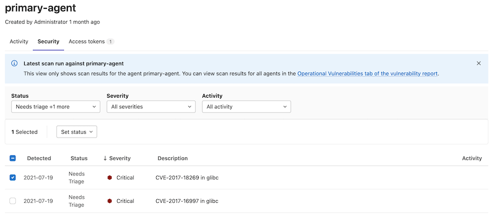

# Operational Container Scanning **(ULTIMATE)**

> - [Introduced](https://gitlab.com/groups/gitlab-org/-/epics/6346) in GitLab 14.8.
> - [Deprecated](https://gitlab.com/gitlab-org/gitlab/-/issues/368828) the starboard directive in GitLab 15.4. The starboard directive is scheduled for removal in GitLab 16.0.

To view cluster vulnerabilities, you can view the [vulnerability report](../../application_security/vulnerabilities/index.md).
You can also configure your agent so the vulnerabilities are displayed with other agent information in GitLab.

## Enable operational container scanning

You can use operational container scanning to scan container images in your cluster for security vulnerabilities. You
can enable the scanner to run on a cadence as configured via the agent, or setup scan execution policies within a
project that houses the agent.

NOTE:
In GitLab 15.0 and later, you do not need to install Starboard operator in the Kubernetes cluster.

### Enable via agent configuration

To enable scanning of all images within your Kubernetes cluster via the agent configuration, add a `container_scanning` configuration block to your agent
configuration with a `cadence` field containing a [CRON expression](https://docs.oracle.com/cd/E12058_01/doc/doc.1014/e12030/cron_expressions.htm) for when the scans are run.

```yaml
container_scanning:
  cadence: '0 0 * * *' # Daily at 00:00 (Kubernetes cluster time)
```

The `cadence` field is required. GitLab supports the following types of CRON syntax for the cadence field:

- A daily cadence of once per hour at a specified hour, for example: `0 18 * * *`
- A weekly cadence of once per week on a specified day and at a specified hour, for example: `0 13 * * 0`

NOTE:
Other elements of the [CRON syntax](https://docs.oracle.com/cd/E12058_01/doc/doc.1014/e12030/cron_expressions.htm) may work in the cadence field if supported by the [cron](https://github.com/robfig/cron) we are using in our implementation, however, GitLab does not officially test or support them.

NOTE:
The CRON expression is evaluated in [UTC](https://www.timeanddate.com/worldclock/timezone/utc) using the system-time of the Kubernetes-agent pod.

By default, operational container scanning attempts to scan the workloads in all
namespaces for vulnerabilities. You can set the `vulnerability_report` block with the `namespaces`
field which can be used to restrict which namespaces are scanned. For example,
if you would like to scan only the `default`, `kube-system` namespaces, you can use this configuration:

```yaml
container_scanning:
  cadence: '0 0 * * *'
  vulnerability_report:
    namespaces:
      - default
      - kube-system
```

## Enable via scan execution policies

To enable scanning of all images within your Kubernetes cluster via scan execution policies, we can use the
[scan execution policy editor](../../application_security/policies/scan-execution-policies.md#scan-execution-policy-editor)
To create a new schedule rule.

NOTE:
The Kubernetes agent must be running in your cluster to scan running container images

Here is an example of a policy which enables operational container scanning within the cluster the Kubernetes agent is attached to:

```yaml
- name: Enforce Container Scanning in cluster connected through my-gitlab-agent for default and kube-system namespaces
  enabled: true
  rules:
  - type: schedule
    cadence: '0 10 * * *'
    agents:
      <agent-name>:
        namespaces:
        - 'default'
        - 'kube-system'
  actions:
  - scan: container_scanning
```

The keys for a schedule rule are:

- `cadence` (required): a [CRON expression](https://docs.oracle.com/cd/E12058_01/doc/doc.1014/e12030/cron_expressions.htm) for when the scans are run
- `agents:<agent-name>` (required): The name of the agent to use for scanning
- `agents:<agent-name>:namespaces` (optional): The Kubernetes namespaces to scan. If omitted, all namespaces are scanned

NOTE:
Other elements of the [CRON syntax](https://docs.oracle.com/cd/E12058_01/doc/doc.1014/e12030/cron_expressions.htm) may work in the cadence field if supported by the [cron](https://github.com/robfig/cron) we are using in our implementation, however, GitLab does not officially test or support them.

NOTE:
The CRON expression is evaluated in [UTC](https://www.timeanddate.com/worldclock/timezone/utc) using the system-time of the Kubernetes-agent pod.

You can view the complete schema within the [scan execution policy documentation](../../application_security/policies/scan-execution-policies.md#scan-execution-policies-schema).

## View cluster vulnerabilities

To view vulnerability information in GitLab:

1. On the left sidebar, at the top, select **Search GitLab** (**{search}**) to find the project that contains the agent configuration file.
1. Select **Operate > Kubernetes clusters**.
1. Select the **Agent** tab.
1. Select an agent to view the cluster vulnerabilities.



This information can also be found under [operational vulnerabilities](../../../user/application_security/vulnerability_report/index.md#operational-vulnerabilities).

NOTE:
You must have at least the Developer role.
