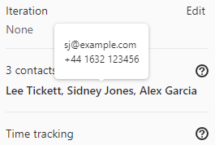

# Customer relations management (CRM) **(FREE)**

> - [Introduced](https://gitlab.com/gitlab-org/gitlab/-/issues/2256) in GitLab 14.6 [with a flag](../../administration/feature_flags.md) named `customer_relations`. Disabled by default.

With customer relations management (CRM) you can create a record of contacts
(individuals) and organizations (companies) and relate them to issues.

You can use contacts and organizations to tie work to customers for billing and reporting purposes.
To read more about what is planned for the future, see [issue 2256](https://gitlab.com/gitlab-org/gitlab/-/issues/2256).

## Permissions

| Permission | Guest            | Reporter | Developer, Maintainer, and Owner |
| ---------- | ---------------- | -------- | -------------------------------- |
| View contacts/organizations | | ✓        | ✓ |
| View issue contacts |         | ✓        | ✓ |
| Add/remove issue contacts |   | ✓        | ✓ |
| Create/edit contacts/organizations | |   | ✓ |

## Enable customer relations management (CRM)

To enable customer relations management in a group:

1. On the top bar, select **Menu > Groups** and find your group.
1. On the left sidebar, select **Settings > General**.
1. Expand the **Permissions and group features** section.
1. Select **Enable customer relations**.
1. Select **Save changes**.

## Contacts

### View contacts linked to a group

To view a group's contacts:

1. On the top bar, select **Menu > Groups** and find your group.
1. On the left sidebar, select **Customer relations > Contacts**.

### Create a contact

To create a contact:

1. On the top bar, select **Menu > Groups** and find your group.
1. On the left sidebar, select **Customer relations > Contacts**.
1. Select **New contact**.
1. Complete all required fields.
1. Select **Create new contact**.

You can also [create](../../api/graphql/reference/index.md#mutationcustomerrelationscontactcreate)
contacts using the GraphQL API.

### Edit a contact

To edit an existing contact:

1. On the top bar, select **Menu > Groups** and find your group.
1. On the left sidebar, select **Customer relations > Contacts**.
1. Next to the contact you wish to edit, select **Edit** (**{pencil}**).
1. Edit the required fields.
1. Select **Save changes**.

You can also [edit](../../api/graphql/reference/index.md#mutationcustomerrelationscontactupdate)
contacts using the GraphQL API.

## Organizations

### View organizations

To view a group's organizations:

1. On the top bar, select **Menu > Groups** and find your group.
1. On the left sidebar, select **Customer relations > Organizations**.

### Create an organization

To create an organization:

1. On the top bar, select **Menu > Groups** and find your group.
1. On the left sidebar, select **Customer relations > Organizations**.
1. Select **New organization**.
1. Complete all required fields.
1. Select **Create new organization**.

You can also [create](../../api/graphql/reference/index.md#mutationcustomerrelationsorganizationcreate)
organizations using the GraphQL API.

### Edit an organization

You can only [edit](../../api/graphql/reference/index.md#mutationcustomerrelationsorganizationupdate)
organizations using the GraphQL API.

## Issues

### View issues linked to a contact

To view a contact's issues:

1. On the top bar, select **Menu > Groups** and find your group.
1. On the left sidebar, select **Customer relations > Contacts**.
1. Next to the contact whose issues you wish to view, select **View issues** (**{issues}**).

### View issues linked to an organization

To view an organization's issues:

1. On the top bar, select **Menu > Groups** and find your group.
1. On the left sidebar, select **Customer relations > Organizations**.
1. Next to the organization whose issues you wish to view, select **View issues** (**{issues}**).

### View contacts linked to an issue

You can view contacts associated with an issue in the right sidebar.

To view a contact's details, hover over the contact's name.

You can also view issue contacts using the
[GraphQL](../../api/graphql/reference/index.md#mutationcustomerrelationsorganizationcreate)
API.

### Add or remove issue contacts

### Add contacts to an issue

To add contacts to an issue use the `/add_contacts`
[quick action](../project/quick_actions.md).

You can also add, remove, or replace issue contacts using the
[GraphQL](../../api/graphql/reference/index.md#mutationissuesetcrmcontacts)
API.

### Remove contacts from an issue

To remove contacts from an issue use the `/remove_contacts`
[quick action](../project/quick_actions.md).

You can also add, remove, or replace issue contacts using the
[GraphQL](../../api/graphql/reference/index.md#mutationissuesetcrmcontacts)
API.
