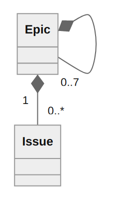
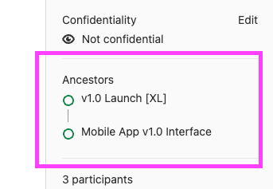
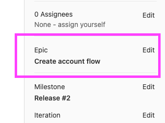

# Planning hierarchies **(PREMIUM)**

Planning hierarchies are an integral part of breaking down your work in GitLab.
To understand how you can use epics and issues together in hierarchies, remember the following:

- [Epics](../epics/index.md) exist in groups.
- [Issues](../../project/issues/index.md) exist in projects.

GitLab is not opinionated on how you structure your work and the hierarchy you can build with multi-level
epics. For example, you can use the hierarchy as a folder of issues for bigger initiatives.

To learn about hierarchies in general, common frameworks, and using GitLab for
portfolio management, see
[How to use GitLab for Agile portfolio planning and project management](https://about.gitlab.com/blog/2020/11/11/gitlab-for-agile-portfolio-planning-project-management/).

## Hierarchies with epics

With epics, you can achieve the following hierarchy:

```mermaid
graph TD
    Group_epic --> Project1_Issue1
    Group_epic --> Project1_Issue2
    Group_epic --> Project2_Issue1
```

### Hierarchies with multi-level epics **(ULTIMATE)**

With the addition of [multi-level epics](../epics/manage_epics.md#multi-level-child-epics) and up to
seven levels of nested epics, you can achieve the following hierarchy:

<!--
Image below was generated with the following Mermaid code.
Attached as an image because a rendered diagram doesn't look clear on the docs page.

```mermaid
classDiagram
  direction TD
  class Epic
  class Issue

  Epic *-- "0..7" Epic
  Epic "1" *-- "0..*" Issue
```

 -->

## View ancestry of an epic

In an epic, you can view the ancestors as parents in the right sidebar under **Ancestors**.

## View ancestry of an issue

In an issue, you can view the parented epic above the issue in the right sidebar under **Epic**.

