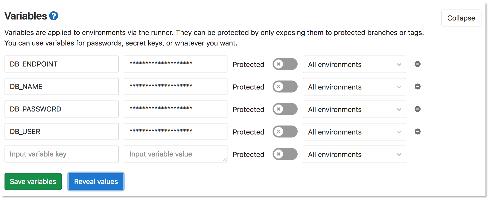

# Runbooks **(FREE)**

Runbooks are a collection of documented procedures that explain how to
carry out a particular process, be it starting, stopping, debugging,
or troubleshooting a particular system.

Using [Jupyter Notebooks](https://jupyter.org/) and the
[Rubix library](https://github.com/Nurtch/rubix),
users can get started writing their own executable runbooks.

Historically, runbooks took the form of a decision tree or a detailed
step-by-step guide depending on the condition or system.

Modern implementations have introduced the concept of an "executable
runbooks", where, along with a well-defined process, operators can execute
pre-written code blocks or database queries against a given environment.

## Executable Runbooks

> [Introduced](https://gitlab.com/gitlab-org/gitlab-foss/-/issues/45912) in GitLab 11.4.

The JupyterHub app offered via the GitLab Kubernetes integration now ships
with Nurtch's Rubix library, providing a simple way to create DevOps
runbooks. A sample runbook is provided, showcasing common operations. While
Rubix makes it simple to create common Kubernetes and AWS workflows, you can
also create them manually without Rubix.

<i class="fa fa-youtube-play youtube" aria-hidden="true"></i>
Watch this [video](https://www.youtube.com/watch?v=Q_OqHIIUPjE)
for an overview of how this is accomplished in GitLab!

## Requirements

To create an executable runbook, you need:

- **Kubernetes** - A Kubernetes cluster is required to deploy the rest of the
  applications. The simplest way to get started is to connect a cluster using the
  [GitLab agent](../../../clusters/agent/index.md).
- **Ingress** - Ingress can provide load balancing, SSL termination, and name-based
  virtual hosting. It acts as a web proxy for your applications.
- **JupyterHub** - [JupyterHub](https://jupyterhub.readthedocs.io/) is a multi-user
  service for managing notebooks across a team. Jupyter Notebooks provide a
  web-based interactive programming environment used for data analysis,
  visualization, and machine learning.

## Nurtch

Nurtch is the company behind the [Rubix library](https://github.com/Nurtch/rubix).
Rubix is an open-source Python library that makes it easy to perform common
DevOps tasks inside Jupyter Notebooks. Tasks such as plotting Cloudwatch metrics
and rolling your ECS/Kubernetes app are simplified down to a couple of lines of
code. See the [Nurtch Documentation](https://docs.nurtch.com/en/latest/) for more
information.

## Configure an executable runbook with GitLab

Follow this step-by-step guide to configure an executable runbook in GitLab using
the components outlined above and the pre-loaded demo runbook.

1. Create an [OAuth application for JupyterHub](../../../../integration/oauth_provider.md).
1. When [installing JupyterHub with Helm](https://zero-to-jupyterhub.readthedocs.io/en/latest/jupyterhub/installation.html),
   use the following values:

   ```yaml
   #-----------------------------------------------------------------------------
   # The gitlab and ingress sections must be customized!
   #-----------------------------------------------------------------------------

   gitlab:
      clientId: <Your OAuth Application ID>
      clientSecret: <Your OAuth Application Secret>
      callbackUrl: http://<Jupyter Hostname>/hub/oauth_callback,
      # Limit access to members of specific projects or groups:
      # allowedGitlabGroups: [ "my-group-1", "my-group-2" ]
      # allowedProjectIds: [ 12345, 6789 ]

   # ingress is required for OAuth to work
   ingress:
      enabled: true
      host: <JupyterHostname>
      # tls:
      #    - hosts:
      #       - <JupyterHostanme>
      #         secretName: jupyter-cert
      # annotations:
      #    kubernetes.io/ingress.class: "nginx"
      #    kubernetes.io/tls-acme: "true"

   #-----------------------------------------------------------------------------
   # NO MODIFICATIONS REQUIRED BEYOND THIS POINT
   #-----------------------------------------------------------------------------

   hub:
      extraEnv:
         JUPYTER_ENABLE_LAB: 1
      extraConfig: |
         c.KubeSpawner.cmd = ['jupyter-labhub']
         c.GitLabOAuthenticator.scope = ['api read_repository write_repository']

         async def add_auth_env(spawner):
            '''
            We set user's id, login and access token on single user image to
            enable repository integration for JupyterHub.
            See: https://gitlab.com/gitlab-org/gitlab-foss/-/issues/47138#note_154294790
            '''
            auth_state = await spawner.user.get_auth_state()

            if not auth_state:
               spawner.log.warning("No auth state for %s", spawner.user)
               return

            spawner.environment['GITLAB_ACCESS_TOKEN'] = auth_state['access_token']
            spawner.environment['GITLAB_USER_LOGIN'] = auth_state['gitlab_user']['username']
            spawner.environment['GITLAB_USER_ID'] = str(auth_state['gitlab_user']['id'])
            spawner.environment['GITLAB_USER_EMAIL'] = auth_state['gitlab_user']['email']
            spawner.environment['GITLAB_USER_NAME'] = auth_state['gitlab_user']['name']

         c.KubeSpawner.pre_spawn_hook = add_auth_env

   auth:
      type: gitlab
      state:
         enabled: true

   singleuser:
      defaultUrl: "/lab"
      image:
         name: registry.gitlab.com/gitlab-org/jupyterhub-user-image
         tag: latest
      lifecycleHooks:
         postStart:
            exec:
            command:
               - "sh"
               - "-c"
               - >
                  git clone https://gitlab.com/gitlab-org/nurtch-demo.git DevOps-Runbook-Demo || true;
                  echo "https://oauth2:${GITLAB_ACCESS_TOKEN}@${GITLAB_HOST}" > ~/.git-credentials;
                  git config --global credential.helper store;
                  git config --global user.email "${GITLAB_USER_EMAIL}";
                  git config --global user.name "${GITLAB_USER_NAME}";
                  jupyter serverextension enable --py jupyterlab_git

   proxy:
      service:
         type: ClusterIP
   ```

1. After JupyterHub has been installed successfully, open the **Jupyter Hostname**
   in your browser. Select **Sign in with GitLab** button to sign in to
   JupyterHub and start the server. Authentication is enabled for any user of the
   GitLab instance with OAuth2. This button redirects you to a page at GitLab
   requesting authorization for JupyterHub to use your GitLab account.

   

1. Select **Authorize**, and GitLab redirects you to the JupyterHub application.
1. Select **Start My Server** to start the server in a few seconds.
1. To configure the runbook's access to your GitLab project, you must enter your
   [GitLab Access Token](../../../profile/personal_access_tokens.md)
   and your Project ID in the **Setup** section of the demo runbook:

   1. Select the **DevOps-Runbook-Demo** folder located on the left panel.

      

   1. Select the `Nurtch-DevOps-Demo.ipynb` runbook.

      

      Jupyter displays the runbook's contents in the right-hand side of the screen.
      The **Setup** section displays your `PRIVATE_TOKEN` and your `PROJECT_ID`.
      Enter these values, maintaining the single quotes as follows:

      ```sql
      PRIVATE_TOKEN = '<your_access_token>'
      PROJECT_ID = '1234567'
      ```

   1. Update the `VARIABLE_NAME` on the last line of this section to match the name of
      the variable you're using for your access token. In this example, our variable
      name is `PRIVATE_TOKEN`.

      ```sql
      VARIABLE_VALUE = project.variables.get('PRIVATE_TOKEN').value
      ```

1. To configure the operation of a runbook, create and configure variables.
   For this example, we are using the **Run SQL queries in Notebook** section in the
   sample runbook to query a PostgreSQL database. The first four lines of the following
   code block define the variables that are required for this query to function:

   ```sql
   %env DB_USER={project.variables.get('DB_USER').value}
   %env DB_PASSWORD={project.variables.get('DB_PASSWORD').value}
   %env DB_ENDPOINT={project.variables.get('DB_ENDPOINT').value}
   %env DB_NAME={project.variables.get('DB_NAME').value}
   ```

   1. Navigate to **Settings > CI/CD > Variables** to create
      the variables in your project.

      

   1. Select **Save variables**.

   1. In Jupyter, select the **Run SQL queries in Notebook** heading, and then select
      **Run**. The results are displayed inline as follows:

      

You can try other operations, such as running shell scripts or interacting with a
Kubernetes cluster. Visit the
[Nurtch Documentation](https://docs.nurtch.com/) for more information.
