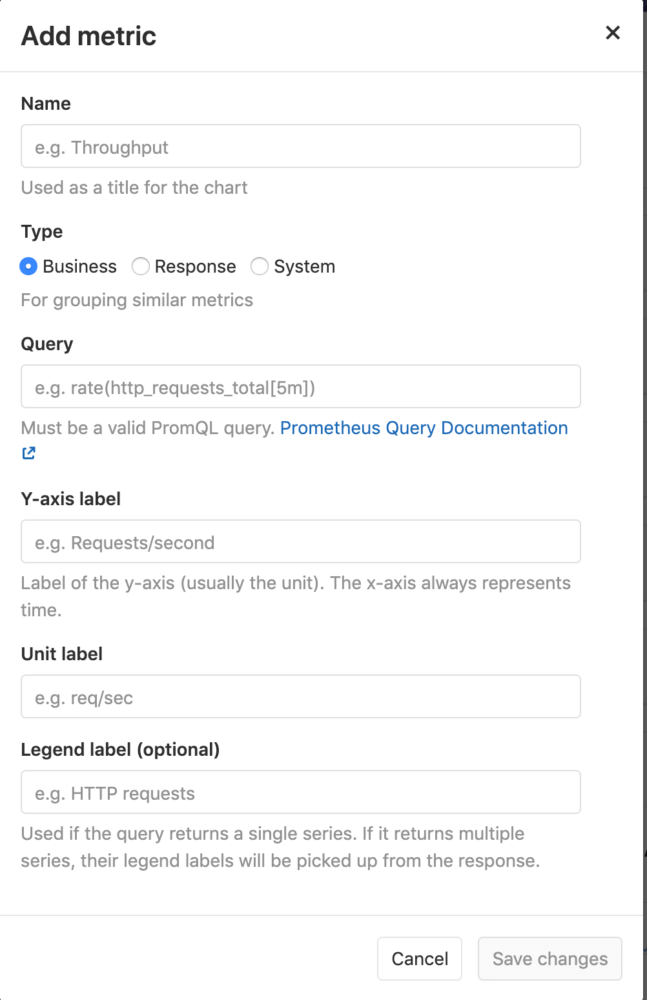
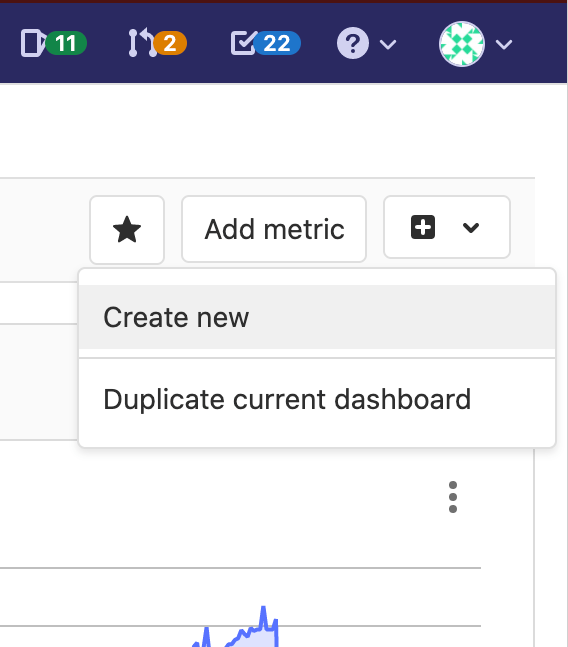
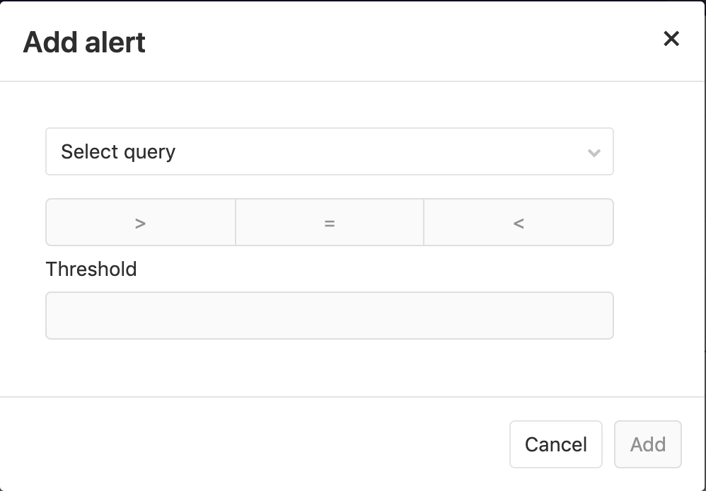

# Prometheus integration

> [Introduced](https://gitlab.com/gitlab-org/gitlab-foss/-/merge_requests/8935) in GitLab 9.0.

GitLab offers powerful integration with [Prometheus](https://prometheus.io) for monitoring key metrics of your apps, directly within GitLab.
Metrics for each environment are retrieved from Prometheus, and then displayed
within the GitLab interface.


There are two ways to set up Prometheus integration, depending on where your apps are running:

- For deployments on Kubernetes, GitLab can automatically [deploy and manage Prometheus](#managed-prometheus-on-kubernetes).
- For other deployment targets, simply [specify the Prometheus server](#manual-configuration-of-prometheus).

Once enabled, GitLab will automatically detect metrics from known services in the [metric library](#monitoring-cicd-environments). You can also [add your own metrics](#adding-custom-metrics).

## Enabling Prometheus Integration

### Managed Prometheus on Kubernetes

> [Introduced](https://gitlab.com/gitlab-org/gitlab-foss/-/issues/28916) in GitLab 10.5.

GitLab can seamlessly deploy and manage Prometheus on a [connected Kubernetes cluster](../clusters/index.md), making monitoring of your apps easy.

#### Requirements

- A [connected Kubernetes cluster](../clusters/index.md)

#### Getting started

Once you have a connected Kubernetes cluster, deploying a managed Prometheus is as easy as a single click.

1. Go to the **Operations > Kubernetes** page to view your connected clusters
1. Select the cluster you would like to deploy Prometheus to
1. Click the **Install** button to deploy Prometheus to the cluster


#### Getting metrics to display on the Metrics Dashboard

After completing the steps above, you will also need deployments in order to view the
**Operations > Metrics** page. Setting up [Auto DevOps](../../../topics/autodevops/index.md)
will help you to quickly create a deployment:

1. Navigate to your project's **Operations > Kubernetes** page, and ensure that,
   in addition to "Prometheus", you also have "Runner" and "Ingress"
   installed. Once "Ingress" is installed, copy its endpoint.
1. Navigate to your project's **Settings > CI/CD** page. In the Auto DevOps section,
   select a deployment strategy and save your changes.
1. On the same page, in the Variables section, add a variable named `KUBE_INGRESS_BASE_DOMAIN`
   with the value of the Ingress endpoint you have copied in the previous step. Leave the type
   as "Variable".
1. Navigate to your project's **CI/CD > Pipelines** page, and run a pipeline on any branch.
1. When the pipeline has run successfully, graphs will be available on the **Operations > Metrics** page.


#### About managed Prometheus deployments

Prometheus is deployed into the `gitlab-managed-apps` namespace, using the [official Helm chart](https://github.com/helm/charts/tree/master/stable/prometheus). Prometheus is only accessible within the cluster, with GitLab communicating through the [Kubernetes API](https://kubernetes.io/docs/concepts/overview/kubernetes-api/).

The Prometheus server will [automatically detect and monitor](https://prometheus.io/docs/prometheus/latest/configuration/configuration/#kubernetes_sd_config) nodes, pods, and endpoints. To configure a resource to be monitored by Prometheus, simply set the following [Kubernetes annotations](https://kubernetes.io/docs/concepts/overview/working-with-objects/annotations/):

- `prometheus.io/scrape` to `true` to enable monitoring of the resource.
- `prometheus.io/port` to define the port of the metrics endpoint.
- `prometheus.io/path` to define the path of the metrics endpoint. Defaults to `/metrics`.

CPU and Memory consumption is monitored, but requires [naming conventions](prometheus_library/kubernetes.md#specifying-the-environment) in order to determine the environment. If you are using [Auto DevOps](../../../topics/autodevops/index.md), this is handled automatically.

The [NGINX Ingress](../clusters/index.md#installing-applications) that is deployed by GitLab to clusters, is automatically annotated for monitoring providing key response metrics: latency, throughput, and error rates.

### Manual configuration of Prometheus

#### Requirements

Integration with Prometheus requires the following:

1. GitLab 9.0 or higher
1. Prometheus must be configured to collect one of the [supported metrics](prometheus_library/index.md)
1. Each metric must be have a label to indicate the environment
1. GitLab must have network connectivity to the Prometheus server

#### Getting started

Installing and configuring Prometheus to monitor applications is fairly straightforward.

1. [Install Prometheus](https://prometheus.io/docs/prometheus/latest/installation/)
1. Set up one of the [supported monitoring targets](prometheus_library/index.md)
1. Configure the Prometheus server to [collect their metrics](https://prometheus.io/docs/prometheus/latest/configuration/configuration/#scrape_config)

#### Configuration in GitLab

The actual configuration of Prometheus integration within GitLab is very simple.
All you will need is the domain name or IP address of the Prometheus server you'd like
to integrate with.

1. Navigate to the [Integrations page](overview.md#accessing-integrations).
1. Click the **Prometheus** service.
1. Provide the domain name or IP address of your server, for example `http://prometheus.example.com/` or `http://192.0.2.1/`.
1. Click **Save changes**.


#### Thanos configuration in GitLab

You can configure [Thanos](https://thanos.io/) as a drop-in replacement for Prometheus
with GitLab. You will need the domain name or IP address of the Thanos server you'd like
to integrate with.

1. Navigate to the [Integrations page](overview.md#accessing-integrations).
1. Click the **Prometheus** service.
1. Provide the domain name or IP address of your server, for example `http://thanos.example.com/` or `http://192.0.2.1/`.
1. Click **Save changes**.

### Precedence with multiple Prometheus configurations

Although you can enable both a [manual configuration](#manual-configuration-of-prometheus)
and [auto configuration](#managed-prometheus-on-kubernetes) of Prometheus, only
one of them will be used:

- If you have enabled a
  [Prometheus manual configuration](#manual-configuration-of-prometheus)
  and a [managed Prometheus on Kubernetes](#managed-prometheus-on-kubernetes),
  the manual configuration takes precedence and is used to run queries from
  [dashboards](#defining-custom-dashboards-per-project) and [custom metrics](#adding-custom-metrics).
- If you have managed Prometheus applications installed on Kubernetes clusters
  at **different** levels (project, group, instance), the order of precedence is described in
  [Cluster precedence](../../instance/clusters/index.md#cluster-precedence).
- If you have managed Prometheus applications installed on multiple Kubernetes
  clusters at the **same** level, the Prometheus application of a cluster with a
  matching [environment scope](../../../ci/environments/index.md#scoping-environments-with-specs) is used.

## Monitoring CI/CD Environments

Once configured, GitLab will attempt to retrieve performance metrics for any
environment which has had a successful deployment.

GitLab will automatically scan the Prometheus server for metrics from known servers like Kubernetes and NGINX, and attempt to identify individual environments. The supported metrics and scan process is detailed in our [Prometheus Metrics Library documentation](prometheus_library/index.md).

You can view the performance dashboard for an environment by [clicking on the monitoring button](../../../ci/environments/index.md#monitoring-environments).

### Adding custom metrics

> - [Introduced](https://gitlab.com/gitlab-org/gitlab/-/merge_requests/3799) in [GitLab Premium](https://about.gitlab.com/pricing/) 10.6.
> - [Moved](https://gitlab.com/gitlab-org/gitlab/-/merge_requests/28527) to [GitLab Core](https://about.gitlab.com/pricing/) 12.10.

Custom metrics can be monitored by adding them on the monitoring dashboard page. Once saved, they will be displayed on the environment performance dashboard provided that either:

- A [connected Kubernetes cluster](../clusters/add_remove_clusters.md) with the environment scope of `*` is used and [Prometheus installed on the cluster](#enabling-prometheus-integration)
- Prometheus is [manually configured](#manual-configuration-of-prometheus).



A few fields are required:

- **Name**: Chart title
- **Type**: Type of metric. Metrics of the same type will be shown together.
- **Query**: Valid [PromQL query](https://prometheus.io/docs/prometheus/latest/querying/basics/).
- **Y-axis label**: Y axis title to display on the dashboard.
- **Unit label**: Query units, for example `req / sec`. Shown next to the value.

Multiple metrics can be displayed on the same chart if the fields **Name**, **Type**, and **Y-axis label** match between metrics. For example, a metric with **Name** `Requests Rate`, **Type** `Business`, and **Y-axis label** `rec / sec` would display on the same chart as a second metric with the same values. A **Legend label** is suggested if this feature is used.

#### Editing additional metrics from the dashboard

> [Introduced](https://gitlab.com/gitlab-org/gitlab/-/issues/208976) in GitLab 12.9.

You can edit existing additional custom metrics by clicking the **{ellipsis_v}** **More actions** dropdown and selecting **Edit metric**.


### Defining custom dashboards per project

> [Introduced](https://gitlab.com/gitlab-org/gitlab-foss/-/issues/59974) in GitLab 12.1.

By default, all projects include a GitLab-defined Prometheus dashboard, which
includes a few key metrics, but you can also define your own custom dashboards.

You may create a new file from scratch or duplicate a GitLab-defined Prometheus
dashboard.

NOTE: **Note:**
The metrics as defined below do not support alerts, unlike
[custom metrics](#adding-custom-metrics).

#### Adding a new dashboard to your project

> UI option [introduced](https://gitlab.com/gitlab-org/gitlab/-/issues/223204) in GitLab 13.2.

You can configure a custom dashboard by adding a new YAML file into your project's
`.gitlab/dashboards/` directory. In order for the dashboards to be displayed on
the project's **{cloud-gear}** **Operations > Metrics** page, the files must have a `.yml`
extension and should be present in the project's **default** branch.

To create a new dashboard from the GitLab user interface:

1. Sign in to GitLab as a user with Maintainer or Owner
   [permissions](../../permissions.md#project-members-permissions).
1. Navigate to your dashboard at **{cloud-gear}** **Operations > Metrics**.
1. In the top-right corner of your dashboard, click the **{file-addition-solid}** **Actions** menu,
   and select **Create new**:
   
1. In the modal window, click **Open Repository**, then follow the instructions
   for creating a new dashboard from the command line.

To create a new dashboard from the command line:

1. Create `.gitlab/dashboards/prom_alerts.yml` under your repository's root
   directory. Each YAML file should define the layout of the dashboard and the
   Prometheus queries used to populate data. This example dashboard displays a
   single area chart:

   ```yaml
   dashboard: 'Dashboard Title'
   panel_groups:
     - group: 'Group Title'
       panels:
         - type: area-chart
           title: "Chart Title"
           y_label: "Y-Axis"
           y_axis:
             format: number
             precision: 0
           metrics:
             - id: my_metric_id
               query_range: 'http_requests_total'
               label: "Instance: {{instance}}, method: {{method}}"
               unit: "count"
   ```

1. Save the file, commit, and push to your repository. The file must be present in your **default** branch.
1. Navigate to your project's **Operations > Metrics** and choose the custom
   dashboard from the dropdown.

NOTE: **Note:**
Configuration files nested under subdirectories of `.gitlab/dashboards` are not
supported and will not be available in the UI.

#### Duplicating a GitLab-defined dashboard

> - [Introduced](https://gitlab.com/gitlab-org/gitlab/-/issues/37238) in GitLab 12.7.
> - From [GitLab 12.8 onwards](https://gitlab.com/gitlab-org/gitlab/-/issues/39505), custom metrics are also duplicated when you duplicate a dashboard.

You can save a complete copy of a GitLab defined dashboard along with all custom metrics added to it.
Resulting `.yml` file can be customized and adapted to your project.
You can decide to save the dashboard `.yml` file in the project's **default** branch or in a
new branch.

1. Click **Duplicate dashboard** in the dashboard dropdown or in the actions menu.

   NOTE: **Note:**
   You can duplicate only GitLab-defined dashboards.

1. Enter the file name and other information, such as the new commit's message, and click **Duplicate**.

If you select your **default** branch, the new dashboard becomes immediately available.
If you select another branch, this branch should be merged to your **default** branch first.

#### Dashboard YAML syntax validation

> [Introduced](https://gitlab.com/gitlab-org/gitlab/-/merge_requests/33202) in GitLab 13.1.

To confirm your dashboard definition contains valid YAML syntax:

1. Navigate to **{doc-text}** **Repository > Files**.
1. Navigate to your dashboard file in your repository.
1. Review the information pane about the file, displayed above the file contents.

Files with valid syntax display **Metrics Dashboard YAML definition is valid**,
and files with invalid syntax display **Metrics Dashboard YAML definition is invalid**.


When **Metrics Dashboard YAML definition is invalid** at least one of the following messages is displayed:

1. `dashboard: can't be blank` [learn more](../../../operations/metrics/dashboards/yaml.md#dashboard-top-level-properties)
1. `panel_groups: should be an array of panel_groups objects` [learn more](../../../operations/metrics/dashboards/yaml.md#dashboard-top-level-properties)
1. `group: can't be blank` [learn more](../../../operations/metrics/dashboards/yaml.md#panel-group-panel_groups-properties)
1. `panels: should be an array of panels objects` [learn more](../../../operations/metrics/dashboards/yaml.md#panel-group-panel_groups-properties)
1. `title: can't be blank` [learn more](../../../operations/metrics/dashboards/yaml.md#panel-panels-properties)
1. `metrics: should be an array of metrics objects` [learn more](../../../operations/metrics/dashboards/yaml.md#panel-panels-properties)
1. `query: can't be blank` [learn more](../../../operations/metrics/dashboards/yaml.md#metrics-metrics-properties)
1. `query_range: can't be blank` [learn more](../../../operations/metrics/dashboards/yaml.md#metrics-metrics-properties)
1. `unit: can't be blank` [learn more](../../../operations/metrics/dashboards/yaml.md#metrics-metrics-properties)
1. `YAML syntax: The parsed YAML is too big`

   This is displayed when the YAML file is larger than 1 MB.

1. `YAML syntax: Invalid configuration format`

   This is displayed when the YAML file is empty or does not contain valid YAML.

Metrics Dashboard YAML definition validation information is also available as a [GraphQL API field](../../../api/graphql/reference/index.md#metricsdashboard)

### Add related links to custom dashboards

> [Introduced](https://gitlab.com/gitlab-org/gitlab/-/issues/216385) in GitLab 13.1.

You can embed links to other dashboards or external services in your custom
dashboard by adding **Related links** to your dashboard's YAML file. Related links
open in the same tab as the dashboard. Related links can be displayed in the
following locations on your dashboard:

- At the top of your dashboard as the top level [`links` dashboard property](../../../operations/metrics/dashboards/yaml.md#dashboard-top-level-properties).
- In charts context menus as the [`links` property of a panel](../../../operations/metrics/dashboards/yaml.md#panel-panels-properties).

Related links can contain the following attributes:

- `url`: The full URL to the link. Required.
- `title`: A phrase describing the link. Optional. If this attribute is not set,
  the full URL is used for the link title.
- `type`: A string declaring the type of link. Optional. If set to `grafana`, the
  dashboard's time range values are converted to Grafana's time range format and
  appended to the `url`.

The dashboard's time range is appended to the `url` as URL parameters.

The following example shows two related links (`GitLab.com` and `GitLab Documentation`)
added to a dashboard:


#### Links Syntax

```yaml
links:
  - title: GitLab.com
    url: https://gitlab.com
  - title: GitLab Documentation
    url: https://docs.gitlab.com
  - title: Public Grafana playground dashboard
    url: https://play.grafana.org/d/000000012/grafana-play-home?orgId=1
    type: grafana
```

### Setting up alerts for Prometheus metrics

#### Managed Prometheus instances

> [Introduced](https://gitlab.com/gitlab-org/gitlab/-/merge_requests/6590) in [GitLab Ultimate](https://about.gitlab.com/pricing/) 11.2 for [custom metrics](#adding-custom-metrics), and 11.3 for [library metrics](prometheus_library/metrics.md).

For managed Prometheus instances using auto configuration, alerts for metrics [can be configured](#adding-custom-metrics) directly in the performance dashboard.

To set an alert:

1. Click on the ellipsis icon in the top right corner of the metric you want to create the alert for.
1. Choose **Alerts**
1. Set threshold and operator.
1. Click **Add** to save and activate the alert.



To remove the alert, click back on the alert icon for the desired metric, and click **Delete**.

#### External Prometheus instances

>- [Introduced](https://gitlab.com/gitlab-org/gitlab/-/issues/9258) in [GitLab Ultimate](https://about.gitlab.com/pricing/) 11.8.
>- [Moved](https://gitlab.com/gitlab-org/gitlab/-/issues/42640) to [GitLab Core](https://about.gitlab.com/pricing/) in 12.10.

For manually configured Prometheus servers, a notify endpoint is provided to use with Prometheus webhooks. If you have manual configuration enabled, an **Alerts** section is added to **Settings > Integrations > Prometheus**. This contains the *URL* and *Authorization Key*. The **Reset Key** button will invalidate the key and generate a new one.


To send GitLab alert notifications, copy the *URL* and *Authorization Key* into the [`webhook_configs`](https://prometheus.io/docs/alerting/latest/configuration/#webhook_config) section of your Prometheus Alertmanager configuration:

```yaml
receivers:
  name: gitlab
  webhook_configs:
    - http_config:
        bearer_token: 9e1cbfcd546896a9ea8be557caf13a76
      send_resolved: true
      url: http://192.168.178.31:3001/root/manual_prometheus/prometheus/alerts/notify.json
  ...
```

In order for GitLab to associate your alerts with an [environment](../../../ci/environments/index.md), you need to configure a `gitlab_environment_name` label on the alerts you set up in Prometheus. The value of this should match the name of your Environment in GitLab.

NOTE: **Note**
In GitLab versions 13.1 and greater, you can configure your manually configured Prometheus server to use the [Generic alerts integration](generic_alerts.md).

### Taking action on incidents **(ULTIMATE)**

>- [Introduced](https://gitlab.com/gitlab-org/gitlab/-/issues/4925) in [GitLab Ultimate](https://about.gitlab.com/pricing/) 11.11.
>- [From GitLab Ultimate 12.5](https://gitlab.com/gitlab-org/gitlab/-/issues/13401), when GitLab receives a recovery alert, it will automatically close the associated issue.

Alerts can be used to trigger actions, like opening an issue automatically (disabled by default since `13.1`). To configure the actions:

1. Navigate to your project's **Settings > Operations > Incidents**.
1. Enable the option to create issues.
1. Choose the [issue template](../description_templates.md) to create the issue from.
1. Optionally, select whether to send an email notification to the developers of the project.
1. Click **Save changes**.

Once enabled, an issue will be opened automatically when an alert is triggered which contains values extracted from [alert's payload](https://prometheus.io/docs/alerting/latest/configuration/#webhook_config):

- Issue author: `GitLab Alert Bot`
- Issue title: Extract from `annotations/title`, `annotations/summary` or `labels/alertname`
- Alert `Summary`: A list of properties
  - `starts_at`: Alert start time via `startsAt`
  - `full_query`: Alert query extracted from `generatorURL`
  - Optional list of attached annotations extracted from `annotations/*`
- Alert [GFM](../../markdown.md): GitLab Flavored Markdown from `annotations/gitlab_incident_markdown`

When GitLab receives a **Recovery Alert**, it will automatically close the associated issue. This action will be recorded as a system message on the issue indicating that it was closed automatically by the GitLab Alert bot.

To further customize the issue, you can add labels, mentions, or any other supported [quick action](../quick_actions.md) in the selected issue template, which will apply to all incidents. To limit quick actions or other information to only specific types of alerts, use the `annotations/gitlab_incident_markdown` field.

Since [version 12.2](https://gitlab.com/gitlab-org/gitlab-foss/-/issues/63373), GitLab will tag each incident issue with the `incident` label automatically. If the label does not yet exist, it will be created automatically as well.

If the metric exceeds the threshold of the alert for over 5 minutes, an email will be sent to all [Maintainers and Owners](../../permissions.md#project-members-permissions) of the project.

## Determining the performance impact of a merge

> - [Introduced](https://gitlab.com/gitlab-org/gitlab-foss/-/merge_requests/10408) in GitLab 9.2.
> - GitLab 9.3 added the [numeric comparison](https://gitlab.com/gitlab-org/gitlab-foss/-/issues/27439) of the 30 minute averages.

Developers can view the performance impact of their changes within the merge
request workflow.

NOTE: **Note:**
Requires [Kubernetes](prometheus_library/kubernetes.md) metrics.

When a source branch has been deployed to an environment, a sparkline and
numeric comparison of the average memory consumption will appear. On the
sparkline, a dot indicates when the current changes were deployed, with up to 30 minutes of
performance data displayed before and after. The comparison shows the difference
between the 30 minute average before and after the deployment. This information
is updated after each commit has been deployed.

Once merged and the target branch has been redeployed, the metrics will switch
to show the new environments this revision has been deployed to.

Performance data will be available for the duration it is persisted on the
Prometheus server.


## Troubleshooting

When troubleshooting issues with a managed Prometheus app, it is often useful to
[view the Prometheus UI](../../../development/prometheus.md#access-the-ui-of-a-prometheus-managed-application-in-kubernetes).

### "No data found" error on Metrics dashboard page

If the "No data found" screen continues to appear, it could be due to:

- No successful deployments have occurred to this environment.
- Prometheus does not have performance data for this environment, or the metrics
  are not labeled correctly. To test this, connect to the Prometheus server and
  [run a query](prometheus_library/kubernetes.md#metrics-supported), replacing `$CI_ENVIRONMENT_SLUG`
  with the name of your environment.
- You may need to re-add the GitLab predefined common metrics. This can be done by running the [import common metrics Rake task](../../../administration/raketasks/maintenance.md#import-common-metrics).
