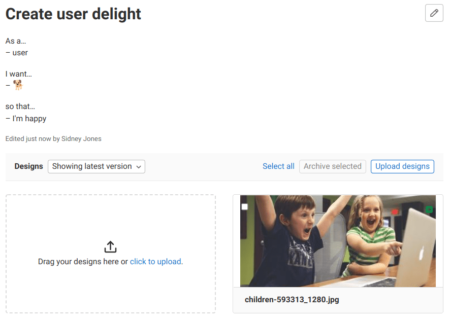
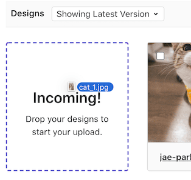

# Design management **(FREE)**

> - [Introduced](https://gitlab.com/groups/gitlab-org/-/epics/660) in GitLab 12.2.
> - Support for SVGs [introduced](https://gitlab.com/gitlab-org/gitlab/-/issues/12771) in GitLab 12.4.
> - [Moved](https://gitlab.com/gitlab-org/gitlab/-/issues/212566) from GitLab Premium to GitLab Free in 13.0.
> - Design Management section in issues [introduced](https://gitlab.com/gitlab-org/gitlab/-/issues/223193) in GitLab 13.2, with a feature flag named `design_management_moved`. In earlier versions, designs were displayed in a separate tab.
> - Design Management section in issues [feature flag removed](https://gitlab.com/gitlab-org/gitlab/-/issues/223197) for new displays in GitLab 13.4.

With Design Management you can upload design assets (including wireframes and mockups)
to GitLab issues and keep them stored in a single place. Product designers, product managers, and
engineers can collaborate on designs with a single source of truth.

You can share mockups of designs with your team, or visual regressions can be
viewed and addressed.

<i class="fa fa-youtube-play youtube" aria-hidden="true"></i>
For a video overview, see [Design Management (GitLab 12.2)](https://www.youtube.com/watch?v=CCMtCqdK_aM).

## Requirements

- [Git Large File Storage (LFS)](../../../topics/git/lfs/index.md) must be enabled:
  - On GitLab.com, LFS is already enabled.
  - On self-managed instances, a GitLab administrator must
    [enable LFS globally](../../../administration/lfs/index.md).
  - On both GitLab.com and self-managed instances, LFS must be
    [enabled for the project itself](../settings/index.md#configure-project-visibility-features-and-permissions).
    If enabled globally, LFS is enabled by default for all projects. If you have
    disabled it for your project, you must enable it again.

  Designs are stored as LFS objects.
  Image thumbnails are stored as other uploads, and are not associated with a project but rather
  with a specific design model.

- Projects must use
  [hashed storage](../../../administration/raketasks/storage.md#migrate-to-hashed-storage).

  Newly created projects use hashed storage by default.

  A GitLab administrator can verify the storage type of a project by going to **Admin Area > Projects**
  and then selecting the project in question. A project can be identified as
  hashed-stored if its **Gitaly relative path** contains `@hashed`.

If the requirements are not met, you are notified in the **Designs** section.

## Supported file types

You can upload files of the following types as designs:

- BMP
- GIF
- ICO
- JPEG
- JPG
- PNG
- SVG
- TIFF
- WEBP

Support for PDF files is tracked in [issue 32811](https://gitlab.com/gitlab-org/gitlab/-/issues/32811).

## Known issues

- Design Management data isn't deleted when:
  - [A project is destroyed](https://gitlab.com/gitlab-org/gitlab/-/issues/13429).
  - [An issue is deleted](https://gitlab.com/gitlab-org/gitlab/-/issues/13427).
- In GitLab 12.7 and later, Design Management data [can be replicated](../../../administration/geo/replication/datatypes.md#limitations-on-replicationverification)
  and in GitLab 16.1 and later it can be [verified by Geo as well](https://gitlab.com/gitlab-org/gitlab/-/issues/355660).

## View a design

The **Designs** section is in the issue description.

Prerequisites:

- You must have at least the Guest role for the project.

To view a design:

1. Go to an issue.
1. In the **Designs** section, select the design image you want to view.

The design you selected opens. You can then [zoom in](#zoom-in-on-a-design) on it or
[create a comment](#add-a-comment-to-a-design).



When viewing a design, you can move to other designs. To do so, either:

- In the upper-right corner, select **Go to previous design** (**{chevron-lg-left}**) or **Go to next design** (**{chevron-lg-right}**).
- Press <kbd>Left</kbd> or <kbd>Right</kbd> on your keyboard.

To return to the issue view, either:

- In the upper-left corner, select the close icon (**{close}**).
- Press <kbd>Esc</kbd> on your keyboard.

When a design is added, a green icon (**{plus-square}**) is displayed on the image
thumbnail. When a design has been [changed](#add-a-new-version-of-a-design) in the current version,
a blue icon (**{file-modified-solid}**) is displayed.

### Zoom in on a design

> - [Introduced](https://gitlab.com/gitlab-org/gitlab/-/issues/13217) in GitLab 12.7.
> - Ability to drag a zoomed image to move it [introduced](https://gitlab.com/gitlab-org/gitlab/-/issues/197324) in GitLab 12.10.

You can explore a design in more detail by zooming in and out of the image:

- To control the amount of zoom, select plus (`+`) and minus (`-`)
  at the bottom of the image.
- To reset the zoom level, select the redo icon (**{redo}**).

To move around the image while zoomed in, drag the image.

## Add a design to an issue

> Ability to edit the description [introduced](https://gitlab.com/gitlab-org/gitlab/-/issues/388449) in GitLab 16.1.

Prerequisites:

- You must have at least the Developer role for the project.
- In GitLab 13.1 and later, the names of the uploaded files must be no longer than 255 characters.

To add a design to an issue:

1. Go to an issue.
1. Either:
   - Select **Upload designs** and then select images from your file browser. You can select up to
     10 files at once.
   <!-- vale gitlab.SubstitutionWarning = NO -->
   - Select **click to upload** and then select images from your file browser. You can select up to
     10 files at once.
   <!-- vale gitlab.SubstitutionWarning = YES -->

   - Drag a file from your file browser and drop it in the drop zone in the **Designs** section.

     

   - Take a screenshot or copy a local image file into your clipboard, hover your cursor over the
     drop zone, and press <kbd>Control</kbd> or <kbd>Cmd</kbd> + <kbd>V</kbd>.

     When pasting images like this, keep the following in mind:

     - You can paste only one image at a time. When you paste multiple copied files, only the first
       one is uploaded.
     - If you are pasting a screenshot, the image is added as a PNG file with a generated name of:
       `design_<timestamp>.png`.
     - It's not supported in Internet Explorer.

## Add a new version of a design

As discussion on a design continues, you might want to upload a new version of a design.

Prerequisites:

- You must have at least the Developer role for the project.

To do so, [add a design](#add-a-design-to-an-issue) with the same filename.

To browse all the design versions, use the dropdown list at the top of the **Designs** section.

### Skipped designs

When you upload an image with the same filename as an existing uploaded design _and_ that is the
same, it's skipped. This means that no new version of the design is created.
When designs are skipped, a warning message is displayed.

## Archive a design

> - [Introduced](https://gitlab.com/gitlab-org/gitlab/-/issues/11089) in GitLab 12.4.
> - [Renamed](https://gitlab.com/gitlab-org/gitlab/-/issues/220964) the button from "Delete" to "Archive" in GitLab 13.3.

You can archive individual designs or select a few of them to archive at once.

Prerequisites:

- You must have at least the Developer role for the project.

To archive a single design:

1. Select the design to view it enlarged.
1. In the upper-right corner, select **Archive design** (**{archive}**).
1. Select **Archive designs**.

To archive multiple designs at once:

1. Select the checkboxes on the designs you want to archive.
1. Select **Archive selected**.

NOTE:
Only the latest version of the designs can be archived.
Archived designs are not permanently lost. You can browse
[previous versions](#add-a-new-version-of-a-design).

<!-- When content_editor_on_issues flag is removed, move version notes
     to "Add a design to an issue", update that topic, and delete the one below. -->

## Markdown and rich text editors for descriptions

> - [Introduced](https://gitlab.com/gitlab-org/gitlab/-/issues/388449) in GitLab 16.1 [with a flag](../../../administration/feature_flags.md) named `content_editor_on_issues`. Disabled by default.
> - [Enabled on GitLab.com and self-managed](https://gitlab.com/gitlab-org/gitlab/-/issues/375172) in GitLab 16.2.

FLAG:
On self-managed GitLab, by default the rich text editor is available. To hide it, an administrator can [disable the feature flag](../../../administration/feature_flags.md) named `content_editor_on_issues`.
On GitLab.com, this feature is available.

When this feature is enabled, you can use the Markdown and rich text editor in design descriptions.
It's the same editor you use for comments across GitLab.

## Reorder designs

> [Introduced](https://gitlab.com/gitlab-org/gitlab/-/issues/34382) in GitLab 13.3.

You can change the order of designs by dragging them to a new position.

## Add a comment to a design

> Adjusting a pin's position [introduced](https://gitlab.com/gitlab-org/gitlab/-/issues/34353) in GitLab 12.8.

You can start [discussions](../../discussions/index.md) on uploaded designs. To do so:

<!-- vale gitlab.SubstitutionWarning = NO -->
1. Go to an issue.
1. Select the design.
1. Click or tap the image. A pin is created in that spot, identifying the discussion's location.
1. Enter your message.
1. Select **Comment**.
<!-- vale gitlab.SubstitutionWarning = YES -->

You can adjust a pin's position by dragging it around the image. You can use this when your design's
layout has changed, or when you want to move a pin to add a new one in its place.

New discussion threads get different pin numbers, which you can use to refer to them.

In GitLab 12.5 and later, new discussions are output to the issue activity,
so that everyone involved can participate in the discussion.

## Delete a comment from a design

> [Introduced](https://gitlab.com/gitlab-org/gitlab/-/issues/385100) in GitLab 15.9.

Prerequisites:

- You must have at least the Reporter role for the project.

To delete a comment from a design:

1. On the comment you want to delete, select **More actions** **{ellipsis_v}** **> Delete comment**.
1. On the confirmation dialog, select **Delete comment**.

## Resolve a discussion thread on a design

> [Introduced](https://gitlab.com/gitlab-org/gitlab/-/issues/13049) in GitLab 13.1.

When you're done discussing part of a design, you can resolve the discussion thread.

To mark a thread as resolved or unresolved, either:

- In the upper-right corner of the first comment of the discussion, select **Resolve thread** or **Unresolve thread** (**{check-circle}**).
- Add a new comment to the thread and select or clear the **Resolve thread** checkbox.

Resolving a discussion thread also marks any pending [to-do items](../../todos.md) related to notes
inside the thread as done. Only to-do items for the user triggering the action are affected.

Your resolved comment pins disappear from the design to free up space for new discussions.
To revisit a resolved discussion, expand **Resolved Comments** below the visible threads.

## Add a to-do item for a design

> - [Introduced](https://gitlab.com/gitlab-org/gitlab/-/issues/198439) in GitLab 13.4.
> - [Feature flag removed](https://gitlab.com/gitlab-org/gitlab/-/issues/245074) in GitLab 13.5.

To add a [to-do item](../../todos.md) for a design, select **Add a to do** on the design sidebar.

## Refer to a design in Markdown

> - [Introduced](https://gitlab.com/gitlab-org/gitlab/-/issues/217160) in GitLab 13.1.
> - [Feature flag removed](https://gitlab.com/gitlab-org/gitlab/-/issues/258662) in GitLab 13.5.

To refer to a design in a [Markdown](../../markdown.md) text box in GitLab, for example, in
a comment or description, paste its URL. It's then displayed as a short reference.

For example, if you refer to a design somewhere with:

```markdown
See https://gitlab.com/gitlab-org/gitlab/-/issues/13195/designs/Group_view.png.
```

It's rendered as:

> See [#13195[Group_view.png]](https://gitlab.com/gitlab-org/gitlab/-/issues/13195/designs/Group_view.png).

## Design activity records

> - [Introduced](https://gitlab.com/gitlab-org/gitlab/-/issues/33051) in GitLab 13.1.
> - [Feature flag removed](https://gitlab.com/gitlab-org/gitlab/-/issues/225205) in GitLab 13.2.

User activity events on designs (creation, deletion, and updates) are tracked by GitLab and
displayed on the [user profile](../../profile/index.md#access-your-user-profile),
[group](../../group/manage.md#view-group-activity),
and [project](../working_with_projects.md#view-project-activity) activity pages.

## GitLab-Figma plugin

> [Introduced](https://gitlab.com/gitlab-org/gitlab-figma-plugin/-/issues/2) in GitLab 13.2.

You can use the GitLab-Figma plugin to upload your designs from Figma directly to your issues
in GitLab.

To use the plugin in Figma, install it from the [Figma Directory](https://www.figma.com/community/plugin/860845891704482356)
and connect to GitLab through a personal access token.

For more information, see the [plugin documentation](https://gitlab.com/gitlab-org/gitlab-figma-plugin/-/wikis/home).
