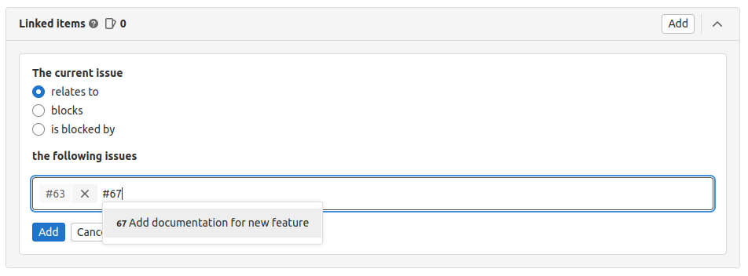
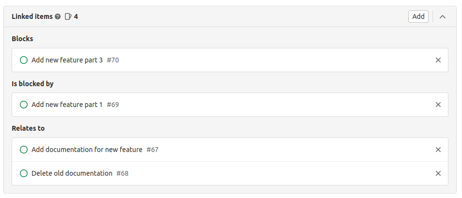

# Linked issues **(FREE ALL)**

> The simple "relates to" relationship [moved](https://gitlab.com/gitlab-org/gitlab/-/issues/212329) from GitLab Premium to GitLab Free in 13.4.

Linked issues are a bi-directional relationship between any two issues and appear in a block below
the issue description. You can link issues in different projects.

The relationship only shows up in the UI if the user can see both issues. When you try to close an
issue that has open blockers, a warning is displayed.

NOTE:
To manage linked issues through our API, see [Issue links API](../../../api/issue_links.md).

## Add a linked issue

> - [Introduced](https://gitlab.com/gitlab-org/gitlab/-/issues/2035) in GitLab 12.8.
> - [Improved](https://gitlab.com/gitlab-org/gitlab/-/issues/34239) to warn when attempting to close an issue that is blocked by others in GitLab 13.0.
>   When you try to close an issue with open blockers, you see a warning that you can dismiss.

Prerequisites:

- You must have at least the Reporter role for both projects.

To link one issue to another:

1. In the **Linked items** section of an issue,
   select the add linked issue button (**{plus}**).
1. Select the relationship between the two issues. Either:
   - **relates to**
   - **[blocks](#blocking-issues)**
   - **[is blocked by](#blocking-issues)**
1. Input the issue number or paste in the full URL of the issue.

   

   Issues of the same project can be specified just by the reference number.
   Issues from a different project require additional information like the
   group and the project name. For example:

   - The same project: `#44`
   - The same group: `project#44`
   - Different group: `group/project#44`

   Valid references are added to a temporary list that you can review.

1. When you have added all the linked issues, select **Add**.

When you have finished adding all linked issues, you can see
them categorized so their relationships can be better understood visually.

You can also add a linked issue from a commit message or the description in another issue or MR.
For more information, see [Crosslinking issues](crosslinking_issues.md).

## Remove a linked issue

In the **Linked items** section of an issue, select the remove button (**{close}**) on the
right-side of each issue token to remove.

Due to the bi-directional relationship, the relationship no longer appears in either issue.

Access our [permissions](../../permissions.md) page for more information.

## Blocking issues **(PREMIUM)**

When you [add a linked issue](#add-a-linked-issue), you can show that it **blocks** or
**is blocked by** another issue.

Issues that block other issues have an icon (**{issue-block}**) next to their title, shown in the
issue lists and [boards](../issue_board.md).
The icon disappears when the blocking issue is closed or their relationship is changed or
[removed](#remove-a-linked-issue).

If you try to close a blocked issue using the "Close issue" button, a confirmation message appears.
