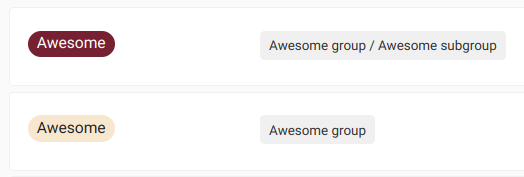
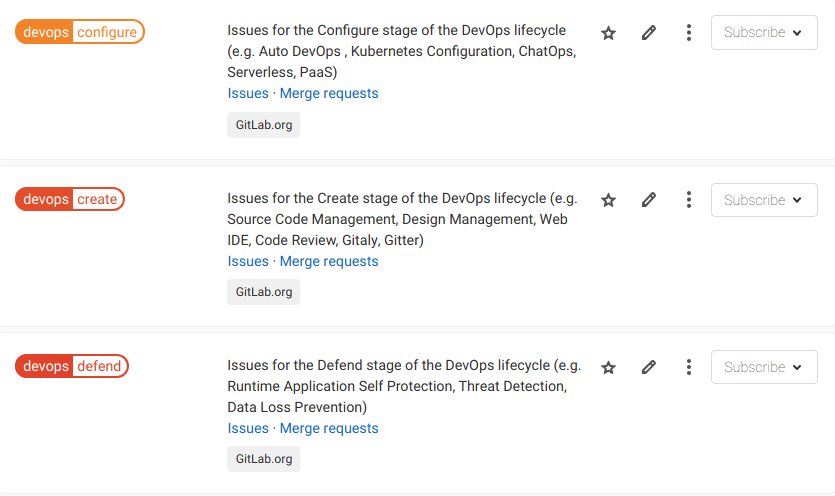
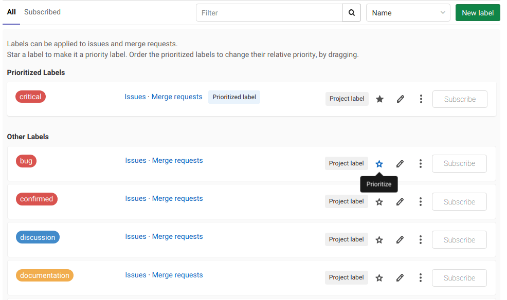

# Labels **(FREE ALL)**

As your count of issues, merge requests, and epics grows in GitLab, it gets more challenging
to keep track of those items. Especially as your organization grows from just a few people to
hundreds or thousands. With labels, you can organize and tag your work, and track the work items
you're interested in.

Labels are a key part of [issue boards](issue_board.md). With labels you can:

- Categorize [epics](../group/epics/index.md), issues, and merge requests using colors and descriptive titles like
`bug`, `feature request`, or `docs`.
- Dynamically filter and manage [epics](../group/epics/index.md), issues, and merge requests.
- Search lists of issues, merge requests, and epics, as well as issue boards.

## Types of labels

You can use two types of labels in GitLab:

- **Project labels** can be assigned to issues and merge requests in that project only.
- **Group labels** can be assigned to issues, merge requests, and [epics](../group/epics/index.md)
  in any project in the selected group or its subgroups.

## Assign and unassign labels

> - Unassigning labels with the **X** button [introduced](https://gitlab.com/gitlab-org/gitlab/-/issues/216881) in GitLab 13.5.
> - Real-time updates in the sidebar [introduced](https://gitlab.com/gitlab-org/gitlab/-/issues/241538) in GitLab 14.10 with a [feature flag](../../administration/feature_flags.md) named `realtime_labels`, disabled by default.
> - Real-time updates in the sidebar [enabled on GitLab.com](https://gitlab.com/gitlab-org/gitlab/-/issues/357370#note_991987201) in GitLab 15.1.
> - Real-time updates in the sidebar [enabled by default](https://gitlab.com/gitlab-org/gitlab/-/issues/357370) in GitLab 15.5.
> - Real-time updates in the sidebar [generally available](https://gitlab.com/gitlab-org/gitlab/-/merge_requests/103199) in GitLab 15.6. Feature flag `realtime_labels` removed.

You can assign labels to any issue, merge request, or epic.

Changed labels are immediately visible to other users, without refreshing the page, on the following:

- Epics
- Incidents
- Issues
- Merge requests

To assign or unassign a label:

1. In the **Labels** section of the sidebar, select **Edit**.
1. In the **Assign labels** list, search for labels by typing their names.
   You can search repeatedly to add more labels.
   The selected labels are marked with a checkmark.
1. Select the labels you want to assign or unassign.
1. To apply your changes to labels, select **X** next to **Assign labels** or select any area
   outside the label section.

Alternatively, to unassign a label, select the **X** on the label you want to unassign.

You can also assign and unassign labels with [quick actions](quick_actions.md):

- Assign labels with `/label`.
- Remove labels with `/unlabel`.
- Remove all labels and assign new ones with `/relabel`.

## View available labels

### View project labels

> [Introduced](https://gitlab.com/gitlab-org/gitlab/-/issues/241990) in GitLab 13.5: the label list in a project also shows all inherited labels.

To view the **project's labels**:

1. On the left sidebar, at the top, select **Search GitLab** (**{search}**) to find your project.
1. Select **Manage > Labels**.

Or:

1. View an issue or merge request.
1. On the right sidebar, in the **Labels** section, select **Edit**.
1. Select **Manage project labels**.

The list of labels includes both the labels created in the project and
all labels created in the project's ancestor groups. For each label, you can see the
project or group path where it was created.

### View group labels

To view the **group's labels**:

1. On the left sidebar, at the top, select **Search GitLab** (**{search}**) to find your group.
1. Select **Manage > Labels**.

Or:

1. View an epic.
1. On the right sidebar, in the **Labels** section, select **Edit**.
1. Select **Manage group labels**.

The list includes all labels created only in the group. It does not list any labels created in
the group's projects.

## Create a label

Prerequisites:

- You must have at least the Reporter role for the project or group.

### Create a project label

To create a project label:

1. On the left sidebar, at the top, select **Search GitLab** (**{search}**) to find your project.
1. Select **Manage > Labels**.
1. Select **New label**.
1. In the **Title** field, enter a short, descriptive name for the label. You
   can also use this field to create [scoped, mutually exclusive labels](#scoped-labels).
1. Optional. In the **Description** field, enter additional
   information about how and when to use this label.
1. Optional. Select a color by selecting from the available colors, or enter a hex color value for
   a specific color in the **Background color** field.
1. Select **Create label**.

### Create a project label from an issue or merge request

You can also create a new project label from an issue or merge request.
Labels you create this way belong to the same project as the issue or merge request.

Prerequisites:

- You must have at least the Reporter role for the project.

To do so:

1. View an issue or merge request.
1. On the right sidebar, in the **Labels** section, select **Edit**.
1. Select **Create project label**.
1. Fill in the name field. You can't specify a description if creating a label this way.
   You can add a description later by [editing the label](#edit-a-label).
1. Select a color by selecting from the available colors, or enter a hex color value for a specific color.
1. Select **Create**. Your label is created and selected.

### Create a group label

To create a group label:

1. On the left sidebar, at the top, select **Search GitLab** (**{search}**) to find your group.
1. Select **Manage > Labels**.
1. Select **New label**.
1. In the **Title** field, enter a short, descriptive name for the label. You
   can also use this field to create [scoped, mutually exclusive labels](#scoped-labels).
1. Optional. In the **Description** field, enter additional
   information about how and when to use this label.
1. Optional. Select a color by selecting from the available colors, or enter a hex color value for
   a specific color in the **Background color** field.
1. Select **Create label**.

### Create a group label from an epic **(PREMIUM)**

You can also create a new group label from an epic.
Labels you create this way belong to the same group as the epic.

Prerequisites:

- You must have at least the Reporter role for the group.

To do so:

1. View an epic.
1. On the right sidebar, in the **Labels** section, select **Edit**.
1. Select **Create group label**.
1. Fill in the name field. You can't specify a description if creating a label this way.
   You can add a description later by [editing the label](#edit-a-label).
1. Select a color by selecting from the available colors,enter input a hex color value for a specific color.
1. Select **Create**.

## Edit a label

Prerequisites:

- You must have at least the Reporter role for the project or group.

### Edit a project label

To edit a **project** label:

1. On the left sidebar, at the top, select **Search GitLab** (**{search}**) to find your project.
1. Select **Manage > Labels**.
1. Next to the label you want to edit, select **Edit** (**{pencil}**).

### Edit a group label

To edit a **group** label:

1. On the left sidebar, at the top, select **Search GitLab** (**{search}**) to find your group.
1. Select **Manage > Labels**.
1. Next to the label you want to edit, select **Edit** (**{pencil}**).

## Delete a label

WARNING:
If you delete a label, it is permanently deleted. All references to the label are removed from the
system and you cannot undo the deletion.

Prerequisites:

- You must have at least the Reporter role for the project.

### Delete a project label

To delete a **project** label:

1. On the left sidebar, at the top, select **Search GitLab** (**{search}**) to find your project.
1. Select **Manage > Labels**.
1. Either:

   - Next to the **Subscribe** button, select (**{ellipsis_v}**).
   - Next to the label you want to edit, select **Edit** (**{pencil}**).

1. Select **Delete**.

### Delete a group label

To delete a **group** label:

1. On the left sidebar, at the top, select **Search GitLab** (**{search}**) to find your group.
1. Select **Manage > Labels**.
1. Either:

   - Next to the **Subscribe** button, select (**{ellipsis_v}**).
   - Next to the label you want to edit, select **Edit** (**{pencil}**).

1. Select **Delete**.

## Promote a project label to a group label

> [Introduced](https://gitlab.com/gitlab-org/gitlab/-/issues/231472) in GitLab 13.6: promoting a project label keeps that label's ID and changes it into a group label. Previously, promoting a project label created a new group label with a new ID and deleted the old label.

You might want to make a project label available for other
projects in the same group. Then, you can promote the label to a group label.

If other projects in the same group have a label with the same title, they are all
merged with the new group label. If a group label with the same title exists, it is
also merged.

WARNING:
Promoting a label is a permanent action and cannot be reversed.

Prerequisites:

- You must have at least the Reporter role for the project.
- You must have at least the Reporter role for the project's parent group.

To promote a project label to a group label:

1. On the left sidebar, at the top, select **Search GitLab** (**{search}**) to find your project.
1. Select **Manage > Labels**.
1. Next to the **Subscribe** button, select the three dots (**{ellipsis_v}**) and
   select **Promote to group label**.

All issues, merge requests, issue board lists, issue board filters, and label subscriptions
with the old labels are assigned to the new group label.

The new group label has the same ID as the previous project label.

## Promote a subgroup label to the parent group

It's not possible to directly promote a group label to the parent group.
To achieve this, use the following workaround.

Prerequisites:

- There must be a group that contains subgroups ("parent group").
- There must be a subgroup in the parent group, that has a label you want to promote.
- You must have at least the Reporter role for both groups.

To "promote" the label to the parent group:

1. In the parent group, [create a label](#create-a-group-label) with the same name as the original
   one. We recommend making it a different color so you don't mistake the two while you're doing this.
1. In the subgroup, [view its labels](#view-group-labels). You should see the two labels and where
   they come from:

   

1. Next to the subgroup label (the old one), select **Issues**, **Merge requests**, or **Epics**.
1. Add the new label to issues, merge requests, and epics that have the old label.
   To do it faster, use [bulk editing](issues/managing_issues.md#bulk-edit-issues-from-a-group).
1. In the subgroup or the parent group, [delete the label](#delete-a-group-label) that belongs to
   the lower-level group.

You should now have a label in the parent group that is named the same as the old one, and added
to the same issues, MRs, and epics.

## Generate default project labels

If a project or its parent group has no labels, you can generate a default set of project
labels from the label list page.

Prerequisites:

- You must have at least the Reporter role for the project.
- The project must have no labels present.

To add the default labels to the project:

1. On the left sidebar, at the top, select **Search GitLab** (**{search}**) to find your project.
1. Select **Manage > Labels**.
1. Select **Generate a default set of labels**.

The following labels are created:

- `bug`
- `confirmed`
- `critical`
- `discussion`
- `documentation`
- `enhancement`
- `suggestion`
- `support`

## Scoped labels **(PREMIUM)**

Teams can use scoped labels to annotate issues, merge requests, and epics with mutually exclusive
labels. By preventing certain labels from being used together, you can create more complex workflows.

A scoped label uses a double-colon (`::`) syntax in its title, for example: `workflow::in-review`.

An issue, merge request, or epic cannot have two scoped labels, of the form `key::value`,
with the same `key`. If you add a new label with the same `key` but a different `value`,
the previous `key` label is replaced with the new label.

<i class="fa fa-youtube-play youtube" aria-hidden="true"></i>
For a video overview, see [Scoped Labels Speed Run](https://www.youtube.com/watch?v=ebyCiKMFODg).

### Filter by scoped labels

> [Introduced](https://gitlab.com/gitlab-org/gitlab/-/issues/12285) in GitLab 14.4.

To filter issue, merge request, or epic lists by a given scope, enter
`<scope>::*` in the searched label name.

For example, filtering by the `platform::*` label returns issues that have `platform::iOS`,
`platform::Android`, or `platform::Linux` labels.

NOTE:
Filtering by scoped labels not available on the issues or merge requests dashboard pages.

### Scoped labels examples

**Example 1.** Updating issue priority:

1. You decide that an issue is of low priority, and assign it the `priority::low` label.
1. After more review, you realize the issue's priority is higher increased, and you assign it the
   `priority::high` label.
1. Because an issue shouldn't have two priority labels at the same time, GitLab removes the
   `priority::low` label.

**Example 2.** You want a custom field in issues to track the operating system platform
that your features target, where each issue should only target one platform.

You create three labels:

- `platform::iOS`
- `platform::Android`
- `platform::Linux`

If you assign any of these labels to an issue automatically removes any other existing label that
starts with `platform::`.

**Example 3.** You can use scoped labels to represent the workflow states of your teams.

Suppose you have the following labels:

- `workflow::development`
- `workflow::review`
- `workflow::deployed`

If an issue already has the label `workflow::development` and a developer wants to show that the
issue is now under review, they assign the `workflow::review`, and the `workflow::development` label
is removed.

The same happens when you move issues across label lists in an
[issue board](issue_board.md). With scoped labels, team members not working in an
issue board can also advance workflow states consistently in issues themselves.

For a video explanation, see:

  See the video: <a href="https://www.youtube.com/watch?v=4BCBby6du3c">Use scoped labels for custom fields and custom workflows</a>.

<figure class="video-container">
  <iframe src="https://www.youtube-nocookie.com/embed/4BCBby6du3c" frameborder="0" allowfullscreen> </iframe>
</figure>

### Nested scopes

You can create a label with a nested scope by using multiple double colons `::` when creating
it. In this case, everything before the last `::` is the scope.

For example, if your project has these labels:

- `workflow::backend::review`
- `workflow::backend::development`
- `workflow::frontend::review`

An issue **can't** have both `workflow::backend::review` and `workflow::backend::development`
labels at the same time, because they both share the same scope: `workflow::backend`.

On the other hand, an issue **can** have both `workflow::backend::review` and `workflow::frontend::review`
labels at the same time, because they both have different scopes: `workflow::frontend` and `workflow::backend`.

## Receive notifications when a label is used

You can subscribe to a label to [receive notifications](../profile/notifications.md) whenever the
label is assigned to an issue, merge request, or epic.

To subscribe to a label:

1. [View the label list page.](#view-available-labels)
1. To the right of any label, select **Subscribe**.
1. Optional. If you are subscribing to a group label from a project, select either:
   - **Subscribe at project level** to be notified about events in this project.
   - **Subscribe at group level** to be notified about events in the whole group.

## Set label priority

Labels can have relative priorities, which are used when you sort issue and merge request lists
by [label priority](issues/sorting_issue_lists.md#sorting-by-label-priority) and [priority](issues/sorting_issue_lists.md#sorting-by-priority).

When prioritizing labels, you must do it from a project.
It's not possible to do it from the group label list.

NOTE:
Priority sorting is based on the highest priority label only.
[This discussion](https://gitlab.com/gitlab-org/gitlab/-/issues/14523) considers changing this.

Prerequisites:

- You must have at least the Reporter role for the project.

To prioritize a label:

1. On the left sidebar, at the top, select **Search GitLab** (**{search}**) to find your project.
1. Select **Manage > Labels**.
1. Next to a label you want to prioritize, select the star (**{star-o}**).

This label now appears at the top of the label list, under **Prioritized Labels**.

To change the relative priority of these labels, drag them up and down the list.
The labels higher in the list get higher priority.

To learn what happens when you sort by priority or label priority, see
[Sorting and ordering issue lists](issues/sorting_issue_lists.md).

## Related topics

Practice working with labels in the following tutorials:

- [Set up a single project for issue triage](../../tutorials/issue_triage/index.md)
- [Set up issue boards for team hand-off](../../tutorials/boards_for_teams/index.md)

## Troubleshooting

### Some label titles end with `_duplicate<number>`

In specific circumstances it was possible to create labels with duplicate titles in the same
namespace.

To resolve the duplication, [in GitLab 13.2](https://gitlab.com/gitlab-org/gitlab/-/merge_requests/21384)
and later, some duplicate labels have `_duplicate<number>` appended to their titles.

You can safely change these labels' titles if you prefer.
For details of the original problem, see [issue 30390](https://gitlab.com/gitlab-org/gitlab/-/issues/30390).
