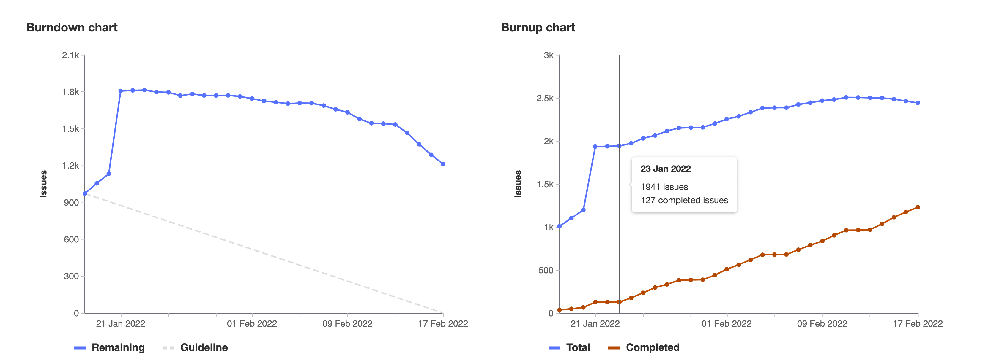
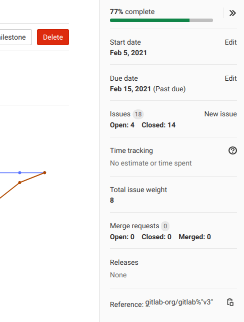

# Milestones **(FREE)**

Milestones in GitLab are a way to track issues and merge requests created to achieve a broader goal in a certain period of time.

Milestones allow you to organize issues and merge requests into a cohesive group, with an optional start date and an optional due date.

## Milestones as releases

Milestones can be used to track releases. To do so:

1. Set the milestone due date to represent the release date of your release and leave the milestone start date blank.
1. Set the milestone title to the version of your release, such as `Version 9.4`.
1. Add an issue to your release by associating the desired milestone from the issue's right-hand sidebar.

Additionally, you can integrate milestones with the [Releases feature](../releases/index.md#associate-milestones-with-a-release).

## Project milestones and group milestones

A milestone can belong to [project](../index.md) or [group](../../group/index.md).

You can assign **project milestones** to issues or merge requests in that project only.
You can assign **group milestones** to any issue or merge request of any project in that group.

For information about project and group milestones API, see:

- [Project Milestones API](../../../api/milestones.md)
- [Group Milestones API](../../../api/group_milestones.md)

### View project or group milestones

To view the milestone list:

1. On the left sidebar, at the top, select **Search GitLab** (**{search}**) to find your project or group.
1. Select **Plan > Milestones**.

In a project, GitLab displays milestones that belong to the project.
In a group, GitLab displays milestones that belong to the group and all projects in the group.

### View milestones in a project with issues turned off

If a project has issue tracking
[turned off](../settings/index.md#configure-project-visibility-features-and-permissions),
to get to the milestones page, enter its URL.

To do so:

1. Go to your project.
1. Add: `/-/milestones` to your project URL.
   For example `https://gitlab.com/gitlab-org/sample-data-templates/sample-gitlab-project/-/milestones`.

Alternatively, this project's issues are visible in the group's milestone page.

Improving this experience is tracked in issue [339009](https://gitlab.com/gitlab-org/gitlab/-/issues/339009).

### View all milestones

You can view all the milestones you have access to in the entire GitLab namespace.
You might not see some milestones because they're in projects or groups you're not a member of.

To do so:

1. On the left sidebar, expand the top-most chevron (**{chevron-down}**).
1. Select **Your work**.
1. On the left sidebar, select **Milestones**.

### View milestone details

To view more information about a milestone,
in the milestone list select the title of the milestone you want to view.

The milestone view shows the title and description.

There are also tabs below these that show the following:

- **Issues**: Shows all issues assigned to the milestone. These are displayed in three columns named:
  - Unstarted Issues (open and unassigned)
  - Ongoing Issues (open and assigned)
  - Completed Issues (closed)
- **Merge Requests**: Shows all merge requests assigned to the milestone. These are displayed in four columns named:
  - Work in progress (open and unassigned)
  - Waiting for merge (open and assigned)
  - Rejected (closed)
  - Merged
- **Participants**: Shows all assignees of issues assigned to the milestone.
- **Labels**: Shows all labels that are used in issues assigned to the milestone.

#### Burndown charts

The milestone view contains a [burndown and burnup chart](burndown_and_burnup_charts.md),
showing the progress of completing a milestone.

#### Milestone sidebar

The milestone sidebar on the milestone view shows the following:

- Percentage complete, which is calculated as number of closed issues divided by total number of issues.
- The start date and due date.
- The total time spent on all issues and merge requests assigned to the milestone.
- The total issue weight of all issues assigned to the milestone.

## Create a milestone

> [Changed](https://gitlab.com/gitlab-org/gitlab/-/issues/343889) the minimum user role from Developer to Reporter in GitLab 15.0.

You can create a milestone either in a project or a group.

Prerequisites:

- You must have at least the Reporter role for the project or group the milestone belongs to.

To create a milestone:

1. On the left sidebar, at the top, select **Search GitLab** (**{search}**) to find your project or group.
1. Select **Plan > Milestones**.
1. Select **New milestone**.
1. Enter the title.
1. Optional. Enter description, start date, and due date.
1. Select **New milestone**.

## Edit a milestone

> [Changed](https://gitlab.com/gitlab-org/gitlab/-/issues/343889) the minimum user role from Developer to Reporter in GitLab 15.0.

Prerequisites:

- You must have at least the Reporter role for the project or group the milestone belongs to.

To edit a milestone:

1. On the left sidebar, at the top, select **Search GitLab** (**{search}**) to find your project or group.
1. Select **Plan > Milestones**.
1. Select a milestone's title.
1. In the top right corner, select **Milestone actions** (**{ellipsis_v}**) and then select **Edit**.
1. Edit the title, start date, due date, or description.
1. Select **Save changes**.

## Delete a milestone

> [Changed](https://gitlab.com/gitlab-org/gitlab/-/issues/343889) the minimum user role from Developer to Reporter in GitLab 15.0.

Prerequisites:

- You must have at least the Reporter role for the project or group the milestone belongs to.

To edit a milestone:

1. On the left sidebar, at the top, select **Search GitLab** (**{search}**) to find your project or group.
1. Select **Plan > Milestones**.
1. Select a milestone's title.
1. In the top right corner, select **Milestone actions** (**{ellipsis_v}**) and then select **Delete**.
1. Select **Delete milestone**.

## Promote a project milestone to a group milestone

If you are expanding the number of projects in a group, you might want to share the same milestones
among this group's projects. You can also promote project milestones to group milestones to
make them available to other projects in the same group.

Promoting a milestone merges all project milestones across all projects in this group with the same
name into a single group milestone.
All issues and merge requests that were previously assigned to one of these project
milestones become assigned to the new group milestone.

WARNING:
This action cannot be reversed and the changes are permanent.

Prerequisites:

- You must have at least the Reporter role for the group.

To promote a project milestone:

1. On the left sidebar, at the top, select **Search GitLab** (**{search}**) to find your project.
1. Select **Plan > Milestones**.
1. Either:
   - Select **Promote to Group Milestone** (**{level-up}**) next to the milestone you want to promote.
   - Select the milestone title, and then select **Milestone actions** (**{ellipsis_v}**) > **Promote**.
1. Select **Promote Milestone**.

## Assign a milestone to an issue or merge request

Every issue and merge request can be assigned one milestone.
The milestones are visible on every issue and merge request page, on the right sidebar.
They are also visible in the issue board.

To assign or unassign a milestone:

1. View an issue or a merge request.
1. On the right sidebar, next to **Milestones**, select **Edit**.
1. In the **Assign milestone** list, search for a milestone by typing its name.
   You can select from both project and group milestones.
1. Select the milestone you want to assign.

You can also use the `/assign` [quick action](../quick_actions.md) in a comment.

## Filter issues and merge requests by milestone

### Filters in list pages

From the project and group issue/merge request list pages, you can filter by both group and project milestones.

### Filters in issue boards

From [project issue boards](../issue_board.md), you can filter by both group milestones and project
milestones in:

- [Search and filter bar](../issue_board.md#filter-issues)
- [Issue board configuration](../issue_board.md#configurable-issue-boards)

From [group issue boards](../issue_board.md#group-issue-boards), you can filter by only group milestones in:

- [Search and filter bar](../issue_board.md#filter-issues)
- [Issue board configuration](../issue_board.md#configurable-issue-boards)

### Special milestone filters

When filtering by milestone, in addition to choosing a specific project milestone or group milestone, you can choose a special milestone filter.

- **None**: Show issues or merge requests with no assigned milestone.
- **Any**: Show issues or merge requests that have an assigned milestone.
- **Upcoming**: Show issues or merge requests that have been assigned the open milestone and has the nearest due date in the future.
- **Started**: Show issues or merge requests that have an open assigned milestone with a start date that is before today.

<!-- ## Troubleshooting

Include any troubleshooting steps that you can foresee. If you know beforehand what issues
one might have when setting this up, or when something is changed, or on upgrading, it's
important to describe those, too. Think of things that may go wrong and include them here.
This is important to minimize requests for support, and to avoid doc comments with
questions that you know someone might ask.

Each scenario can be a third-level heading, for example `### Getting error message X`.
If you have none to add when creating a doc, leave this section in place
but commented out to help encourage others to add to it in the future. -->
