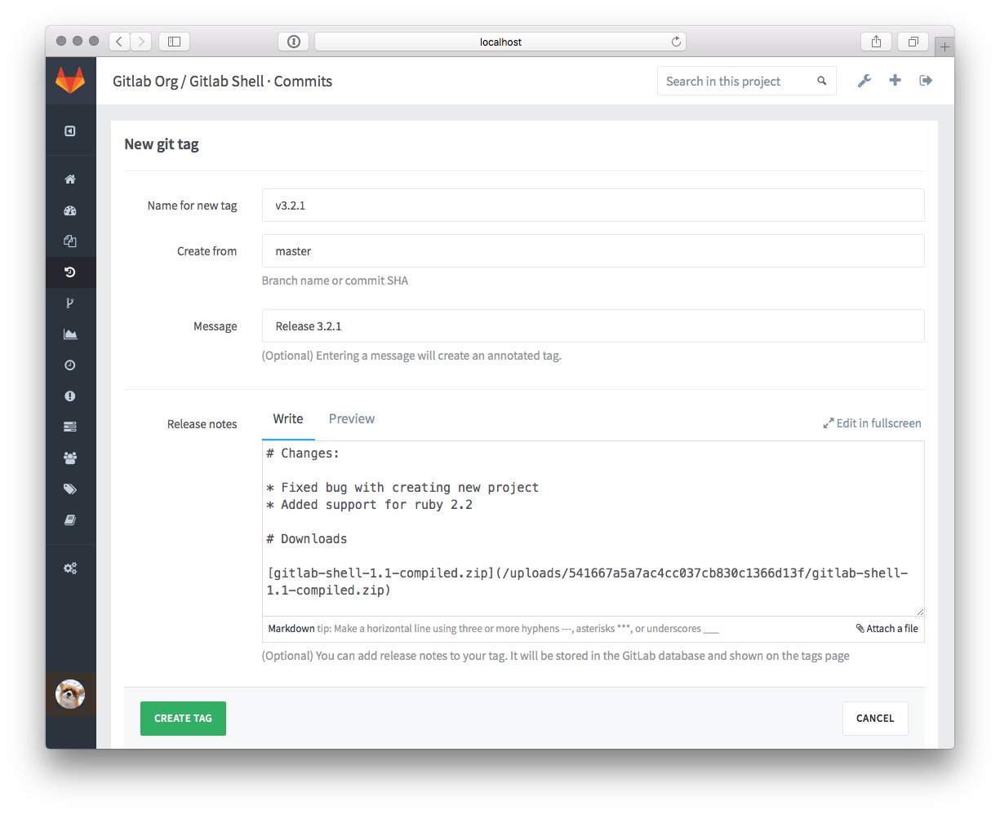
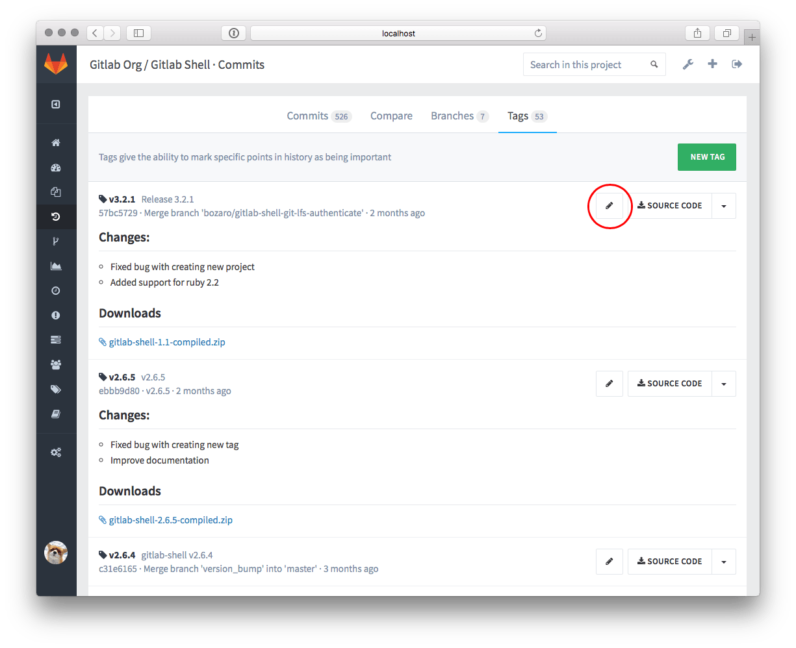

# Releases

> [Introduced](https://gitlab.com/gitlab-org/gitlab-foss/issues/41766) in GitLab 11.7.

It's typical to create a [Git tag](../../../university/training/topics/tags.md) at
the moment of release to introduce a checkpoint in your source code
history, but in most cases your users will need compiled objects or other
assets output by your CI system to use them, not just the raw source
code.

GitLab's **Releases** are a way to track deliverables in your project. Consider them
a snapshot in time of the source, build output, and other metadata or artifacts
associated with a released version of your code.

At the moment, you can create Release entries via the [Releases API](../../../api/releases/index.md);
we recommend doing this as one of the last steps in your CI/CD release pipeline.

If desired, it is still possible to [add release notes to Git tags](releases.md).

## Getting started with Releases

Start by giving a [description](#release-description) to the Release and
including its [assets](#release-assets), as follows.

### Release description

Every Release has a description. You can add any text you like, but we recommend
including a changelog to describe the content of your release. This will allow
your users to quickly scan the differences between each one you publish.

NOTE: **Note:**
[Git's tagging messages](https://git-scm.com/book/en/v2/Git-Basics-Tagging) and
Release descriptions are unrelated. Description supports [markdown](../../markdown.md).

### Release assets

You can currently add the following types of assets to each Release:

- [Source code](#source-code): state of the repo at the time of the Release
- [Links](#links): to content such as built binaries or documentation

GitLab will support more asset types in the future, including objects such
as pre-built packages, compliance/security evidence, or container images.

#### Source code

GitLab automatically generate `zip`, `tar.gz`, `tar.bz2` and `tar`
archived source code from the given Git tag. These are read-only assets.

#### Links

A link is any URL which can point to whatever you like; documentation, built
binaries, or other related materials. These can be both internal or external
links from your GitLab instance.

NOTE: **NOTE**
You can manipulate links of each release entry with [Release Links API](../../../api/releases/links.md)

## Releases list

Navigate to **Project > Releases** in order to see the list of releases for a given
project.

## Notification for Releases

> [Introduced](https://gitlab.com/gitlab-org/gitlab/issues/26001) in GitLab 12.4.

You can be notified by email when a new Release is created for your project.

To subscribe to these notifications, navigate to your **Project**'s landing page, then click on the
bell icon. Choose **Custom** from the dropdown menu. The
following modal window will be then displayed, from which you can select **New release** to complete your subscription to new Releases notifications.

## Add release notes to Git tags

You can add release notes to any Git tag using the notes feature. Release notes
behave like any other markdown form in GitLab so you can write text and
drag-n-drop files to it. Release notes are stored in GitLab's database.

There are several ways to add release notes:

- In the interface, when you create a new Git tag
- In the interface, by adding a note to an existing Git tag
- Using the GitLab API

### New tag page with release notes text area

### Tags page with button to add or edit release notes for existing Git tag

<!-- ## Troubleshooting

Include any troubleshooting steps that you can foresee. If you know beforehand what issues
one might have when setting this up, or when something is changed, or on upgrading, it's
important to describe those, too. Think of things that may go wrong and include them here.
This is important to minimize requests for support, and to avoid doc comments with
questions that you know someone might ask.

Each scenario can be a third-level heading, e.g. `### Getting error message X`.
If you have none to add when creating a doc, leave this section in place
but commented out to help encourage others to add to it in the future. -->
