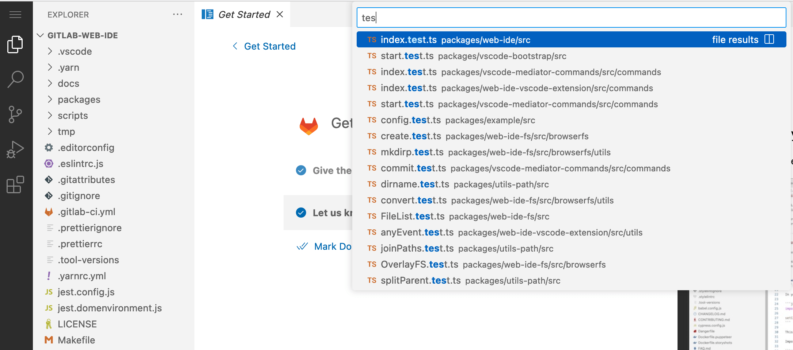

# Web IDE Beta **(FREE)**

> [Introduced](https://gitlab.com/gitlab-org/gitlab/-/merge_requests/95169) in GitLab 15.4 [with a flag](../../../administration/feature_flags.md) named `vscode_web_ide`. Disabled by default.

FLAG:
On self-managed GitLab, by default this feature is not available. To make it available, ask an administrator to [enable the feature flag](../../../administration/feature_flags.md) named `vscode_web_ide`. On GitLab.com, this feature is available.

As announced in [this blog post](https://about.gitlab.com/blog/2022/05/23/the-future-of-the-gitlab-web-ide/),
the current implementation of the Web IDE is being replaced with an
implementation inspired by Visual Studio Code.

This effort is currently under development. For updates,
see [this epic](https://gitlab.com/groups/gitlab-org/-/epics/7683).

## Enable the Web IDE Beta

To use the Web IDE Beta on a self-managed GitLab instance,
ensure that the `vscode_web_ide` feature flag
[is enabled](../../../administration/feature_flags.md).

On GitLab.com, this feature is available by default. However, you can
[stop using it if you choose](#stop-using-the-web-ide-beta).

## Use the Web IDE Beta

To open the Web IDE Beta from anywhere in the UI:

- Use the <kbd>.</kbd> [keyboard shortcut](../../shortcuts.md).

You can also open the Web IDE Beta when viewing a file, the repository file list,
and from merge requests.

### Use when viewing a file or the repository file list

To open the Web IDE Beta from a file or the repository file list:

- On the top right of the page, select **Open in Web IDE**.

If **Open in Web IDE** is not visible:

1. Next to **Edit** or **Gitpod**, select the down arrow (**{chevron-lg-down}**).
1. From the list, select **Open in Web IDE**.
1. Select **Open in Web IDE**.

### Use when viewing a merge request

To open the Web IDE Beta from a merge request:

1. Go to your merge request.
1. In the upper right corner, select **Code > Open in Web IDE**.

## Open a file in the Web IDE Beta

To open any file by its name:

1. Type **Command** + **`P`** (<kbd>⌘</kbd> + <kbd>P</kbd>).
1. Type the name of your file.

## Search across files

You can use VS Code to quickly search all files in the currently opened folder.

To enter your search term:

1. Type **Shift** + **Command** + **`F`** (<kbd>⇧</kbd> + <kbd>⌘</kbd> + <kbd>F</kbd>).
1. Enter your search term.

In the Web IDE Beta, only partial results from opened files are displayed.
Full file search is planned for a later date.

## View list of changed files

To view the list of files you changed in the Web IDE Beta:

- On the VS Code Activity Bar, on the left, select the Source Control icon:

Your `CHANGES`, `STAGED CHANGES` and `MERGE CHANGES` are displayed.

For details, see [the VS Code documentation](https://code.visualstudio.com/docs/sourcecontrol/overview#_commit).

## Known issues

The [Web Terminal](../web_ide/index.md#interactive-web-terminals-for-the-web-ide)
and [Live Preview](../web_ide/index.md#live-preview) are not available in the Web IDE Beta.

These features may become available at a later date.

### Stop using the Web IDE Beta

If you do not want to use the Web IDE Beta, you can change your personal preferences.

1. On the top bar, in the top right corner, select your avatar.
1. Select **Preferences**.
1. In the **Web IDE** section, select the **Opt out of the Web IDE Beta** checkbox.
1. Select **Save changes**.
